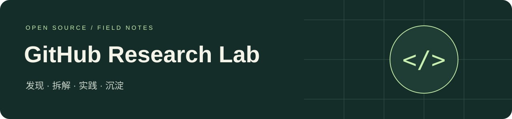
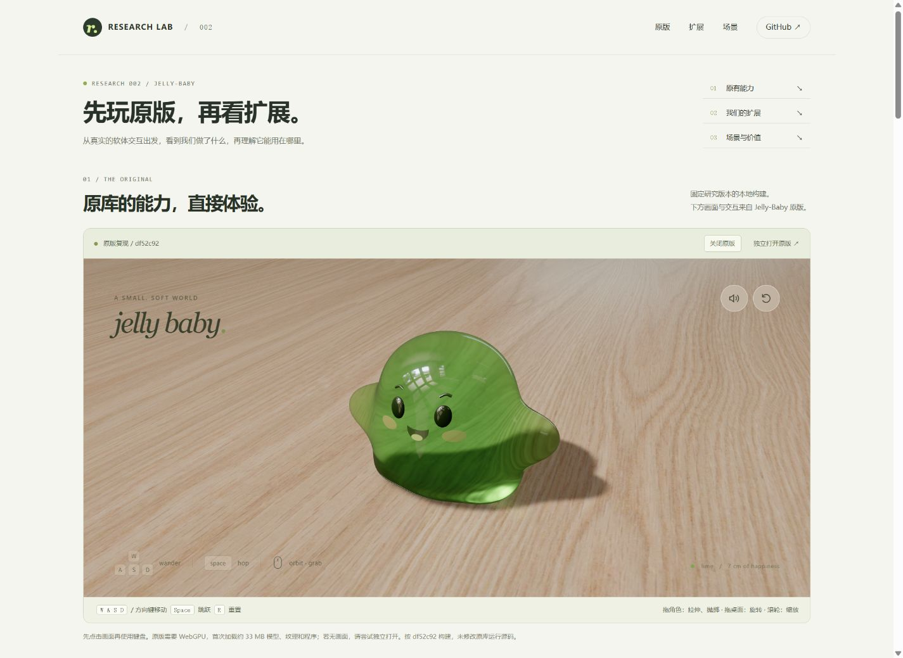
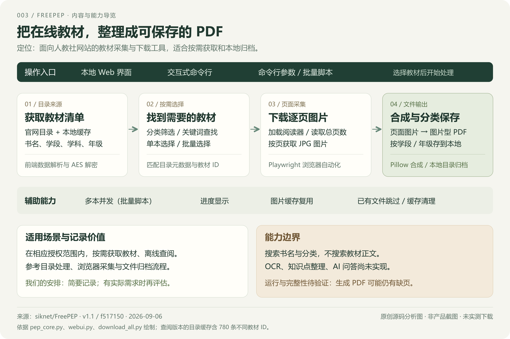
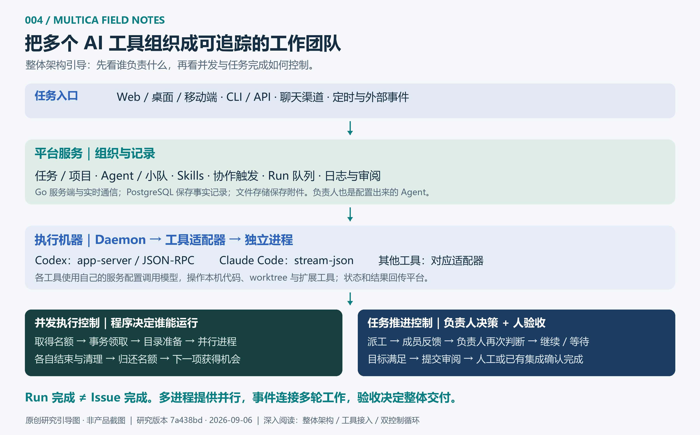

<p align="center"></p>

# GitHub 优秀项目研究库

记录近期遇到的优秀开源项目：理解设计、复现功能、整理结论，并将值得展示的实践做成 Web 演示。

这里是研究总入口。每个子项目拥有固定编号、独立研究文档和图片；首页只保留摘要、索引和展示入口。

[在线研究站](https://yydshly.github.io/0906_codex_project/) · [研究约定与新增指南](CONTRIBUTING.md) · [Web 展示与部署](guides/deployment.md) · [项目登记表](projects.json)

## 有序项目索引

<!-- PROJECT_INDEX:START -->
| 编号 | 项目 | 研究摘要 | 状态 | 原仓库 | Web |
| --- | --- | --- | --- | --- | --- |
| 001 | [倪海厦 Skill · 专家知识组织研究](projects/001-nihaixia/README.md) | 从整体架构看资料如何成为可用知识，对照文件检索、RAG 与 App 路径，展示六类能力及复用价值。 | 研究中 | [源码](https://github.com/jangviktor-web/nihaixia) | [演示](https://yydshly.github.io/0906_codex_project/demos/001-nihaixia/) |
| 002 | [Jelly-Baby · 浏览器软体交互研究](projects/002-jelly-baby/README.md) | 整理软体物理与实时光学能力，复现原版，完成三维伙伴青团、首页导览及真实拉伸驱动的弹性课堂。 | 研究中 | [源码](https://github.com/scottstts/Jelly-Baby) | [演示](https://yydshly.github.io/0906_codex_project/demos/002-jelly-baby/) |
| 003 | [FreePEP 教材下载器](projects/003-freepep/README.md) | 一图查看 780 条人教社教材目录的类别、学科与年级覆盖，支持筛选与批量下载为 PDF。 | 已归档 | [源码](https://github.com/siknet/FreePEP) | — |
| 004 | [Multica · 多 Agent 协作与执行控制研究](projects/004-multica/README.md) | 从 Codex、Claude Code 接入到并发调度与负责人反馈，整理整体架构、源码证据与可交互的教学演示。 | 已完成 | [源码](https://github.com/multica-ai/multica) | [演示](https://yydshly.github.io/0906_codex_project/demos/004-multica/) |
<!-- PROJECT_INDEX:END -->

## 图片速览

<!-- PROJECT_GALLERY:START -->
### 001 · 倪海厦 Skill · 专家知识组织研究

[](projects/001-nihaixia/README.md)

从整体架构看资料如何成为可用知识，对照文件检索、RAG 与 App 路径，展示六类能力及复用价值。

### 002 · Jelly-Baby · 浏览器软体交互研究

[](projects/002-jelly-baby/README.md)

整理软体物理与实时光学能力，复现原版，完成三维伙伴青团、首页导览及真实拉伸驱动的弹性课堂。

### 003 · FreePEP 教材下载器

[](projects/003-freepep/README.md)

一图查看 780 条人教社教材目录的类别、学科与年级覆盖，支持筛选与批量下载为 PDF。

### 004 · Multica · 多 Agent 协作与执行控制研究

[](projects/004-multica/README.md)

从 Codex、Claude Code 接入到并发调度与负责人反馈，整理整体架构、源码证据与可交互的教学演示。
<!-- PROJECT_GALLERY:END -->

## 目录导航

```text
projects.json                 项目元数据与展示顺序
projects/001-project-name/    单个项目的研究文档、实验与代码
docs/index.html              Web 展示总入口
docs/demos/001-project-name/  各项目的静态 Web 演示
docs/assets/projects/        各项目的封面与截图
templates/project/           新研究项目的文档模板
guides/                      维护与部署说明
scripts/catalog.mjs          新建项目、同步索引和校验
```

## 新增研究项目

需要 Node.js 22 或更新版本，无需安装第三方依赖。

```sh
npm run project:new -- --slug project-name --name "项目名称" --repo https://github.com/owner/repository
```

命令自动分配从 `001` 开始的编号、创建研究目录并更新首页。补充 `projects.json` 中的简介、状态、图片和演示地址后，运行 `npm run sync` 同步展示，再运行 `npm run check` 校验。

编号一经分配保持不变；展示顺序由 `order` 决定。模板不计入正式索引。

## 来源与许可

研究文档记录原仓库、研究版本和原始许可证。引用、截图及复用代码保留来源和版权说明；各上游项目的许可证以原仓库为准。本仓库暂未指定统一开源许可证。
