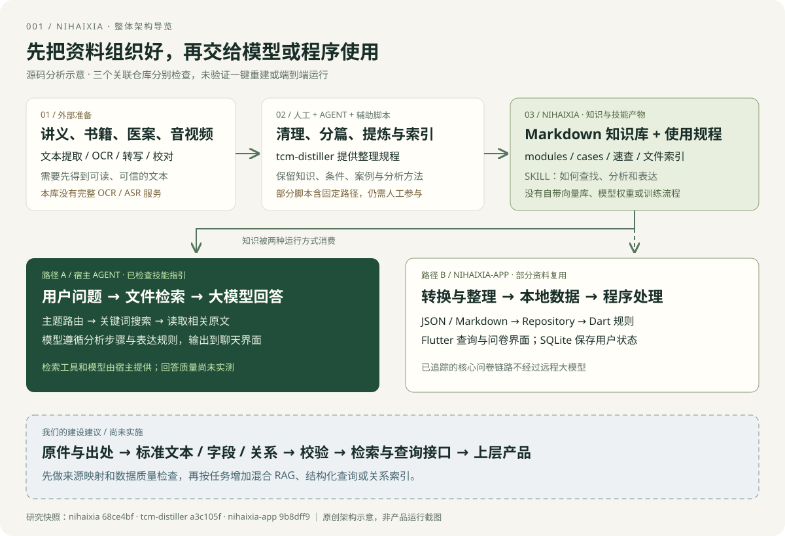
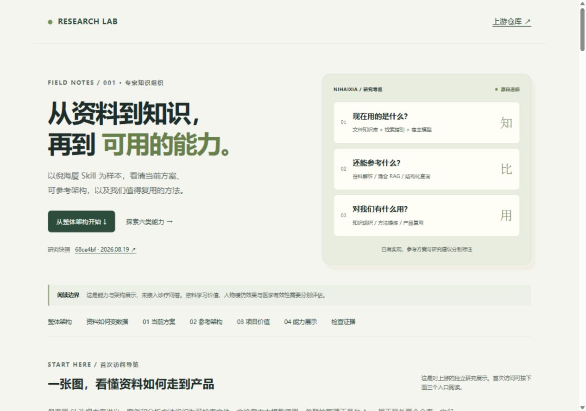
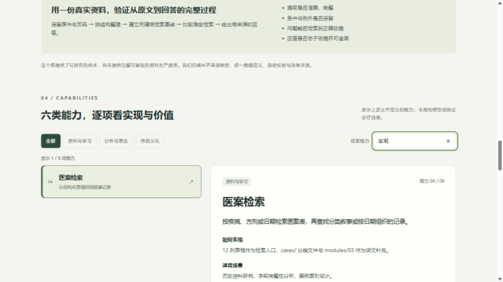
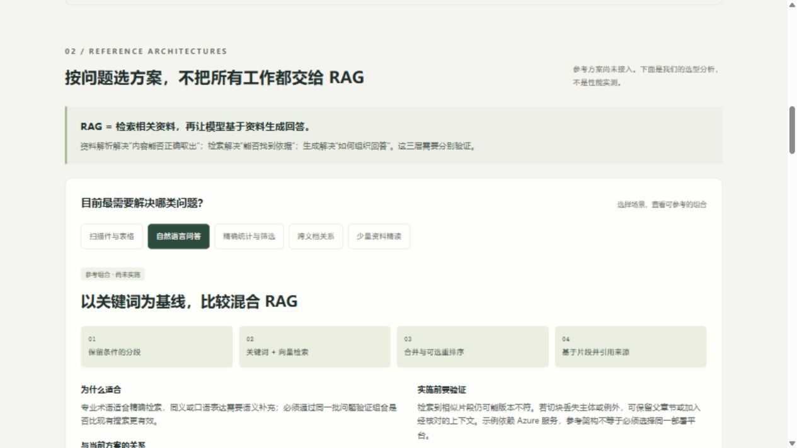

# 001 · 倪海厦 Skill · 专家知识组织研究

> 拆解专家资料如何组织为大模型可调用的知识技能，展示能力、检索流程、使用边界与可迁移方法。

[返回总索引](../../README.md) · [研究过程](notes.md) · [上游仓库](https://github.com/jangviktor-web/nihaixia)

**首次阅读**：[在线导览与整体架构](https://yydshly.github.io/0906_codex_project/demos/001-nihaixia/#overview) → [当前方案与源码依据](architecture.md) → [资料如何成为数据、参考方案与价值](strategy.md)。本项目是独立研究展示，非上游官方产品或在线诊疗服务。



上图为本仓库原创架构示意，非运行截图；底部虚线框为尚未实施的建设建议。[打开原图](../../docs/assets/projects/001-nihaixia/architecture.svg)。

[从资料到知识库与产品：架构追踪](architecture.md) —— 区分知识整理工具、Skill 宿主与独立安卓 App，并提供固定版本的源码对照。

[当前方案、参考架构与复用价值](strategy.md) —— 回答三个核心问题，对照资料解析、混合 RAG、结构化查询等方案，并映射六类能力的借鉴价值。

## 项目档案

| 项目 | 内容 |
| --- | --- |
| 原仓库 | https://github.com/jangviktor-web/nihaixia |
| 研究版本 / Commit | [`68ce4bf21351a35911d173224c1bc66db3e4e754`](https://github.com/jangviktor-web/nihaixia/tree/68ce4bf21351a35911d173224c1bc66db3e4e754)，提交日期 2026-08-19 |
| 上游许可证 | 固定版本根目录未见 LICENSE / LICENCE / COPYING 文件；教学资料授权仍待核实 |
| 当前状态 | 研究中：能力整理、静态结构检查与交互展示完成；宿主运行及回答评测尚未进行 |
| 研究开始日期 | 2026-09-06 |
| Web 演示 | [在线展示](https://yydshly.github.io/0906_codex_project/demos/001-nihaixia/) · [页面源码](../../docs/demos/001-nihaixia/index.html)；本地访问 http://127.0.0.1:8000/demos/001-nihaixia/ |

## 一句话价值

项目展示了“专家知识 → 检索入口 → 分析规程 → 回答表达”的组织方法，适合作为资料学习和知识型 Agent 的研究样本。人物语气、知识覆盖和医学有效性应分别评估。

## 图片与演示



首屏为本仓库实际运行的研究展示页截图，不是上游诊疗产品截图。



展示页支持五种资料处理场景的参考方案切换、主题筛选、关键词搜索、六类能力详情、五步流程浏览与固定版本来源跳转。每项能力包含“对我们的借鉴”。问题示例用于解释功能，未连接 AI 服务，不生成诊疗建议。



[流程截图](../../docs/assets/projects/001-nihaixia/workflow.png) 展示“搜索与读取”步骤；[手机截图](../../docs/assets/projects/001-nihaixia/mobile.png) 展示 390 像素宽度下的参考架构区。所有截图均为本次独立展示页面的真实浏览器截图。

## 研究目标

- [x] 梳理适用场景与核心能力
- [x] 分析关键设计与实现
- [x] 完成固定版本的结构检查与结果记录
- [x] 制作并验证独立交互展示
- [x] 整理可复用结论与局限
- [ ] 在宿主中运行上游技能并评测回答质量（后续范围）

## 能力与场景

以下是对上游文件定义的功能整理，不代表已验证模型可以稳定实现。

| 能力 | 实现方式 | 合适场景 | 边界 |
| --- | --- | --- | --- |
| 经典资料查询 | 篇目导航、主题模块、关键词搜索 | 查术语、条文、讲义解释 | 资料观点不自动成为医学事实 |
| 辨证过程讲解 | 六经、八纲、公式与七步文本规程 | 教学方法分析、提示词研究 | 没有程序强制执行，准确率未测 |
| 方剂资料整理 | 条文卡片、组成与版本速查 | 文献整理、版本比较 | 表格完整不代表处方正确 |
| 医案检索 | 结构化表格、分类叙事、日期索引 | 历史案例研究、字段分析 | 编号行不等于独立有效病例 |
| 人物表达模拟 | 口头禅、比喻、追问、输出检查 | 教学表达、角色风格实验 | 不代表本人发言，可能放大权威感 |
| 传统文化问答 | 易经、紫微斗数、风水等章节 | 文化资料检索、观点整理 | 应与医学证据区分，不作可靠预测 |

来源：[技能入口](https://github.com/jangviktor-web/nihaixia/blob/68ce4bf21351a35911d173224c1bc66db3e4e754/SKILL.md)、[表达规则](https://github.com/jangviktor-web/nihaixia/blob/68ce4bf21351a35911d173224c1bc66db3e4e754/expression_style.md)。

## 本地运行

本展示使用原生 HTML/CSS/JavaScript，无构建步骤、第三方前端依赖、数据库或密钥。本次环境为 Windows、Node.js 22.15.0、Python 3.10。

在仓库根目录运行：

```sh
python -m http.server 8000 --bind 127.0.0.1 --directory docs
```

访问 `http://127.0.0.1:8000/demos/001-nihaixia/`，停止服务使用 Ctrl+C。页面也可直接以文件打开，资源均为相对路径。

复核上游结构需要网络及 Node.js 22，无需安装依赖：

```sh
node projects/001-nihaixia/verify-upstream.mjs
npm run sync
npm run check
```

脚本会更新 `verification.json` 的时间与统计。若更换研究版本，应同步更新脚本、页面来源链接、文字和截图。页面样式统一维护于 `docs/assets/style.css`，用 `.research-page` 和专用组件类限定范围。

上游使用方式是将完整技能目录交由支持技能加载、文件搜索和读取的宿主使用，安装约定以[固定版本 README](https://github.com/jangviktor-web/nihaixia/blob/68ce4bf21351a35911d173224c1bc66db3e4e754/README.md)为准。本项目未安装、激活或执行上游技能。

展示使用 GitHub Pages 从 `main` 分支的 `docs/` 发布，位于 `/0906_codex_project/demos/001-nihaixia/`。后续如接入模型后端，按仓库约定单独部署。发布核验记录见 [研究过程](notes.md)。

## 关键设计

```text
用户问题 → 主题路由 → 文件索引 → 搜索并读取段落
                                      ↓
                             大模型按预设框架组织分析
                                      ↓
                             表达、卡片与完整性检查
```

| 文件或目录 | 职责 |
| --- | --- |
| SKILL.md | 触发条件、资料导航、分析流程与输出规程 |
| modules/ | 14 个主题知识模块 |
| references/distilled/ | 从长资料中提炼的流程、公式与速查表 |
| cases/ | 结构化医案与分类叙事 |
| expression_style.md | 人物表达范式 |
| index.html | 上游项目介绍页，不是独立 AI 问答服务 |

检索以关键词、同义词及文件层级降级为主，由宿主搜索和读取工具执行。功能上属于检索辅助生成；本次目录检查未发现自带向量检索服务、模型训练代码或模型权重。

“蒸馏”主要指知识与方法提炼。七步框架是交给模型的文字指引，并非可执行的诊断规则引擎；“检查不过则重写”也不能替代程序校验或效果评测。

来源：[蒸馏目录](https://github.com/jangviktor-web/nihaixia/blob/68ce4bf21351a35911d173224c1bc66db3e4e754/references/distilled/README.md)、[七步框架](https://github.com/jangviktor-web/nihaixia/blob/68ce4bf21351a35911d173224c1bc66db3e4e754/references/distilled/01-six-meridian-formulas.md)。

## 实验结果与结论

结构检查结果见 [verification.json](verification.json)，脚本见 [verify-upstream.mjs](verify-upstream.mjs)。脚本只请求固定版本目录与少量文件，在内存中统计，不保存讲义正文。

| 检查项 | 本次结果 | 解释 |
| --- | --- | --- |
| 主题模块 | 14 个 Markdown 文件 | 文件数，不是正确率指标 |
| 技能入口大小 | 132,476 字节 | 约 132 KB（十进制），不是 token 数 |
| 医案编号行 | 1,257 行 | 其中 1 行是占位内容；另含续诊及缺失字段 |
| 根目录许可证文件 | 未找到 | 内容授权仍需核实 |
| 常见可执行脚本扩展名 | 未找到独立 .py/.js/.mjs/.ts/.sh/.ipynb 文件 | HTML 仍含页面脚本；这不是安全审计 |
| 检索规则 | 入口包含 Grep / Read 指引 | 说明设计方式，不证明运行时一定遵循 |

人工阅读还发现：入口承认部分分类标签错标及非医案条目混入；表达规则强调确定性收尾并将就医提示放到文末；README 不同位置的资料数量有版本口径差异。上游校验主要比较资料覆盖与内容一致性，其中的覆盖比例不是医学正确率。

来源：[结构化医案表](https://github.com/jangviktor-web/nihaixia/blob/68ce4bf21351a35911d173224c1bc66db3e4e754/cases/00_merged_table.md)、[校验记录](https://github.com/jangviktor-web/nihaixia/blob/68ce4bf21351a35911d173224c1bc66db3e4e754/references/distilled/audit-notes.md)。

本次未验证模型引用准确率、医学内容、病例疗效或多宿主兼容性，不能据此将其用于自动诊断、开方或替代专业医疗判断。网页交互验证详见 [研究记录](notes.md)。

## 后续计划

1. **来源可追溯**：统一来源 ID、文献版本、章节，区分原文、整理和模型推断。
2. **数据标准化**：统一医案字段，区分患者与就诊记录，处理重复、占位、错标和缺失。
3. **建立评测**：同题对比普通模型、仅检索、检索加流程、完整人物风格；测量引用正确率、遗漏和无依据断言。
4. **改进检索**：先补别名与全文索引，再验证语义检索是否改善跨术语查找。
5. **缩小入口**：拆分总入口与按需模块，实测上下文成本、延迟和规则遵循情况。
6. **分离风格与证据**：支持中性讲解，保留来源分歧和不确定性。

上述为扩展建议，本次未实现上游功能改造。

## 对我们的意义

源码解读对应知识模块，复现与故障记录对应案例库，选型与排查步骤对应判断流程，带源码位置和实验依据的结论对应资料卡片。值得迁移的是这种知识组织方式。

下一阶段可选择一个非医疗主题，构建“问题 → 检索片段 → 固定来源 → 解释”的最小研究助手，再用评测验证其效果。

## 来源与致谢

原项目：https://github.com/jangviktor-web/nihaixia。本项目文字与交互为独立研究整理，只保留上游来源链接和结构检查结果，未导入整个上游仓库或讲义、医案全文。根目录许可证和教学资料授权需分别核实；本仓库尚未指定统一开源许可证。
