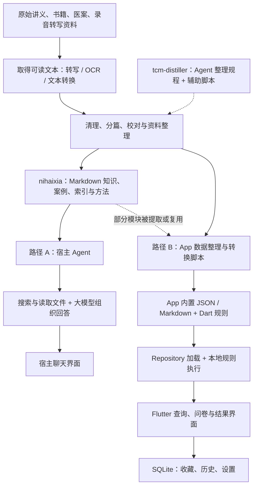

# 001 · 从资料到知识库，再到产品的架构

> 2026-09-06 源码追踪。结论：nihaixia 是知识与技能产物；资料整理工具和独立 App 分属关联仓库。完整链路包含人工整理、Agent 执行的文档规程、数据脚本以及两条不同的运行路径。

[返回项目研究](README.md) · [过程记录](notes.md)

## 范围与版本

| 仓库 | 本次版本 | 本次追踪范围 |
| --- | --- | --- |
| nihaixia | `68ce4bf21351a35911d173224c1bc66db3e4e754`，2026-08-19 | 知识文件、导航、角色与输出规程 |
| tcm-distiller | `a3c105f7b8e72cf996c229d970b6be8512e5a40f`，2026-08-23 | 整理方法、合成规程、索引与校验脚本 |
| nihaixia-app | `9b8dff9281f3b4a643dac8015885c3a4eacec47a`，2026-09-05；默认分支 master | 数据生成、资源加载、问卷、规则引擎、结果与本地存储 |

这是各仓库分别固定的快照，不是经验证的统一发布组合。未编译或运行 App，未执行上游数据转换或模型调用。只读取相关源码；临时源码位于忽略目录，研究文件不导入上游正文。

## 总体结构


[在线导览](https://yydshly.github.io/0906_codex_project/demos/001-nihaixia/#overview) 提供首次访问引导、可放大原图与资料生产说明。上图为原创源码分析示意，底部为建设建议。



图中的资料获取部分是必要的上游准备环节，不代表 nihaixia 已内置音频转写或 OCR 服务。虚线表示相关方法或部分资料的复用；不能据此断言 nihaixia 全部内容由当前 tcm-distiller 一次性自动生成。

nihaixia 的 [README][N1] 明确关联另外两个项目；tcm-distiller 的 [README][D1] 记录了对倪海厦技能的剂量勘误和增量优化。因此可以确认关联与优化关系，但尚无全量、逐条来源到产物的构建记录。

## 1. 资料如何变成可处理文本

nihaixia 的来源清单列出讲义和文集，交付物主要是整理后的 Markdown；仓库本身未提供完整的原始 PDF / 音频 → OCR / ASR → 文本流水线。

tcm-distiller 的 [原文数字化方法][D2] 描述编码统一、OCR 噪音清理、标题提取、目录生成与对照校验。其脚本负责的是已有文本的处理：

| 处理 | 实现位置 | 实際职责 |
| --- | --- | --- |
| 清理 | cleanup_html.py / cleanup_headers.py / cleanup_pages.py | 删除 HTML、页眉、页码等噪音 |
| 分篇 | extract_titles.py | 根据标题层级、白名单与过滤规则提取书、卷、篇 |
| 生成索引 | gen_index.py | 根据标题行号和元数据输出目录及定位表 |
| 索引校验 | validate_index.py | 检查行号与标题是否对应 |
| 引用检查 | validate_keyword_refs.py | 检查引用文件及目标关键词是否存在 |

[gen_index.py][D3] 仍使用固定的中间文件路径、书籍元数据及示例关键词表。因此它提供了可改造的脚本，而不是直接接收任意资料的通用生产服务。数字化方法建议自动定位，但该示例代码仍含固定行号，复用时需要替换并校验。

## 2. 可读文本如何成为知识库

这里的“知识库”首先是有结构的文件集合，并不以数据库或向量化作为前提：

| 知识形态 | nihaixia 中的载体 | 用途 |
| --- | --- | --- |
| 详细解释 | modules/*.md | 保留主题资料，供按需读取 |
| 案例 | cases/00_merged_table.md、分类医案 | 按日期、主题或条目查找 |
| 方法 | references/distilled/*.md | 速查、步骤、鉴别规则 |
| 导航 | SKILL.md 内的主题与关键词表 | 将问题路由到文件和段落 |
| 表达 | expression_style.md | 控制口吻、比喻和课堂式表达 |
| 档案 | references/research/ | 保留资料整理与研究线索 |

tcm-distiller 的 [SKILL.md][D4] 将新技能构建描述为资料分流、多维调研、框架合成、质量验证、增量补充与交付；另有已有技能的优化流程。[框架合成清单][D5] 规定技能应包含哪些导航、案例、规则和主题模块。

这些主要是要求宿主 Agent 执行的工作规程。真正的语义提炼依赖执行该规程的大模型与整理者；并不存在一个 Python 函数自动计算出某位专家的完整判断方法。

[validate_keyword_refs.py][D6] 是实际可执行的结构检查：用正则解析“文件 + 搜索词”，再检查文件存在且包含该词。它能发现失效引用，但不能证明引用支持回答，更不能证明原文医学观点正确。

## 3. 路径 A：知识库如何成为 AI Skill 产品

宿主加载技能元信息和入口规则 → 模型识别主题 → 根据索引调用搜索工具 → 读取文件片段 → 按分析与表达规程组织回答。

[nihaixia/SKILL.md][N2] 是导航与提示约定，作用类似知识包的使用说明，不是 HTTP API 或运行中的调度服务。循环执行、工具调用、上下文和会话由宿主负责。

未命中时，规则要求更换同义词、相关概念和文件层级。这里主要是文件级、关键词式检索，未看到向量嵌入和向量数据库服务。回答前的“自查并重写”同样交由模型遵循，没有程序级的强制通过保证。

上游的 index.html 仅作项目介绍。此路径的实际产品界面是安装该技能的宿主聊天界面。

## 4. 路径 B：资料如何成为安卓 App

App 不仅包装了聊天界面，还把部分内容转成应用数据和确定性的规则代码。

### 4.1 构建时：提取、补录和合并

- [parse_transcript.py][A1]：读取本草讲稿 Markdown，按标题正则划分条目，识别章节和注释，通过名称及别名匹配已有药物条目，更新 herbs.json 的 clinical_notes、historical_notes、herb_comparisons。
- [extract_acupoints.py][A2]：读取本地技能的 modules/09 与原始针灸讲义，提取和清理信息后写出 acupoints.json。代码路径明确显示存在技能资料到 App 数据的转换。
- [gen_formulas_shanghan.py][A3]：代码中预先定义方剂字典，再导出 JSON；它不是通过模型现场理解讲义的抽取器。
- [merge_formulas.py][A4]：读取既有、伤寒、金匮三份数据，按名称合并；同名时选择非空字段更多的一项，排序后写入 formulas.json。

这是一套文本提取、预先整理的数据、补充脚本和合并脚本相结合的流程。部分源文件仍指向作者本机目录，没有随库提供的完整输入；不能保证从公开仓库一键重建全部数据。

“字段更多”只是合并策略，不等于内容更可信。对于来源冲突，更稳妥的后续设计是保留两个版本及各自出处。

### 4.2 装载时：资源包成为应用对象

[pubspec.yaml][A5] 声明 JSON 与 Markdown 资源；[main.dart][A6] 启动时加载多个 Repository。

[FormulaRepository.load()][A7] 的链路是：

```text
assets/data/formulas.json
  → rootBundle.loadString()
  → json.decode()
  → Formula.fromJson()
  → 内存 List<Formula>
```

Formula 模型包含 id、name、alias、meridian、category、components、indication、contraindication、explanation、keywords 等字段。搜索主要对名称、别名、描述、关键词及组成做字符串包含匹配；由规则结果跳转详情时，再按精确名称、别名和子串解析。

医案采用另一种方式：[parseMedicalCaseTable()][A8] 在应用侧解析内置 Markdown 表格，保留空单元格，归一占位值，并排除未公开或缺少可用方剂的条目。因此 App 的可展示集合不能直接等同于上游所有编号行。

### 4.3 运行时：问卷 → 本地规则 → 结构化结果

[ChatScreen][A9] 持有 DiagnosticEngine，管理问题选项、答案、回退快照与聊天气泡。核心调用为：

```text
用户选择问卷选项
  → DiagnosticEngine 保存答案与扩展信号
  → diagnose()
  → diagnoseByRules()
  → RuleEngine.top() / evaluate()
  → 查询 FormulaRepository 补充详情
  → 返回 DiagnosisResult
  → ChatScreen 展示结果与来源资料
```

[RuleEngine.evaluate()][A10] 会遍历 allFormulaRules：所有必选条件满足才进入候选，参考条件增加分数，按得分排序。源码中的排序分为：

```text
score = requiredHits × 3 + referenceHits × 1
```

同分时还比较扩展必选信号数量与预设鉴别链顺序。[DiagnosticEngine.diagnose()][A11] 优先使用该结果；没有合适公式结果时，转入既有的六经与杂病分支逻辑。

它另有 FormulaMatcher 的关键词与口语线索加权匹配，不是向量语义相似度。主规则结果的 confidence 也由命中数量和固定公式构造，不应解释为经过临床校准的正确概率。

因此，已检查的 App 核心问卷链路由本地 Dart 规则执行，未经过远程大模型推理。聊天气泡只是交互形式。

### 4.4 保存时：SQLite 主要记录用户状态

[DatabaseHelper][A12] 创建收藏、问答历史、搜索历史、诊断历史、设置、医案收藏、最近浏览和自定义命盘等表。方剂等主要知识内容从资源包加载，并非统一存入这套 SQLite 数据库。

App 有 http 依赖；检查的 update_service.dart 用它查询 GitHub release 并下载更新。因此“核心判断离线”不应被扩展成“整个应用完全没有网络行为”。

## 5. 三种资产应分开管理

| 资产 | 当前例子 | 更成熟的管理方向 |
| --- | --- | --- |
| 原始资料 | 讲义、文稿 | 保留原件、来源、授权与版本 |
| 知识产物 | Markdown、JSON | 稳定 ID、统一字段、来源映射和差异记录 |
| 执行策略 | 提示规程、Dart 规则 | 独立版本、回归测试、边界测试与效果评测 |

当前已经可以看清“资料整理 → 知识交付 → 两种消费方式”，但它不是单一服务中的全自动管线。资料的来源追踪、脚本参数化、跨产物同步和端到端可复现性，仍有建设空间。

对我们的可迁移价值：研究资料可以同时供 AI 检索和传统应用查询使用；判断步骤可以先以文档表达，稳定且可验证的部分再写成程序规则。应避免让同一事实在文档、JSON 和代码中各维护一份而逐渐漂移。

## 源码来源

[N1]: https://github.com/jangviktor-web/nihaixia/blob/68ce4bf21351a35911d173224c1bc66db3e4e754/README.md
[N2]: https://github.com/jangviktor-web/nihaixia/blob/68ce4bf21351a35911d173224c1bc66db3e4e754/SKILL.md
[D1]: https://github.com/jangviktor-web/tcm-distiller/blob/a3c105f7b8e72cf996c229d970b6be8512e5a40f/README.md
[D2]: https://github.com/jangviktor-web/tcm-distiller/blob/a3c105f7b8e72cf996c229d970b6be8512e5a40f/references/20-original-text-digitalization.md
[D3]: https://github.com/jangviktor-web/tcm-distiller/blob/a3c105f7b8e72cf996c229d970b6be8512e5a40f/scripts/gen_index.py
[D4]: https://github.com/jangviktor-web/tcm-distiller/blob/a3c105f7b8e72cf996c229d970b6be8512e5a40f/SKILL.md
[D5]: https://github.com/jangviktor-web/tcm-distiller/blob/a3c105f7b8e72cf996c229d970b6be8512e5a40f/references/phase2-checklist.md
[D6]: https://github.com/jangviktor-web/tcm-distiller/blob/a3c105f7b8e72cf996c229d970b6be8512e5a40f/scripts/validate_keyword_refs.py
[A1]: https://github.com/jangviktor-web/nihaixia-app/blob/9b8dff9281f3b4a643dac8015885c3a4eacec47a/scripts/parse_transcript.py
[A2]: https://github.com/jangviktor-web/nihaixia-app/blob/9b8dff9281f3b4a643dac8015885c3a4eacec47a/scripts/extract_acupoints.py
[A3]: https://github.com/jangviktor-web/nihaixia-app/blob/9b8dff9281f3b4a643dac8015885c3a4eacec47a/scripts/gen_formulas_shanghan.py
[A4]: https://github.com/jangviktor-web/nihaixia-app/blob/9b8dff9281f3b4a643dac8015885c3a4eacec47a/scripts/merge_formulas.py
[A5]: https://github.com/jangviktor-web/nihaixia-app/blob/9b8dff9281f3b4a643dac8015885c3a4eacec47a/pubspec.yaml
[A6]: https://github.com/jangviktor-web/nihaixia-app/blob/9b8dff9281f3b4a643dac8015885c3a4eacec47a/lib/main.dart
[A7]: https://github.com/jangviktor-web/nihaixia-app/blob/9b8dff9281f3b4a643dac8015885c3a4eacec47a/lib/data/formula_repository.dart
[A8]: https://github.com/jangviktor-web/nihaixia-app/blob/9b8dff9281f3b4a643dac8015885c3a4eacec47a/lib/data/medical_case_data.dart
[A9]: https://github.com/jangviktor-web/nihaixia-app/blob/9b8dff9281f3b4a643dac8015885c3a4eacec47a/lib/screens/chat_screen.dart
[A10]: https://github.com/jangviktor-web/nihaixia-app/blob/9b8dff9281f3b4a643dac8015885c3a4eacec47a/lib/engine/rule_engine.dart
[A11]: https://github.com/jangviktor-web/nihaixia-app/blob/9b8dff9281f3b4a643dac8015885c3a4eacec47a/lib/engine/diagnostic_engine.dart
[A12]: https://github.com/jangviktor-web/nihaixia-app/blob/9b8dff9281f3b4a643dac8015885c3a4eacec47a/lib/data/database_helper.dart
