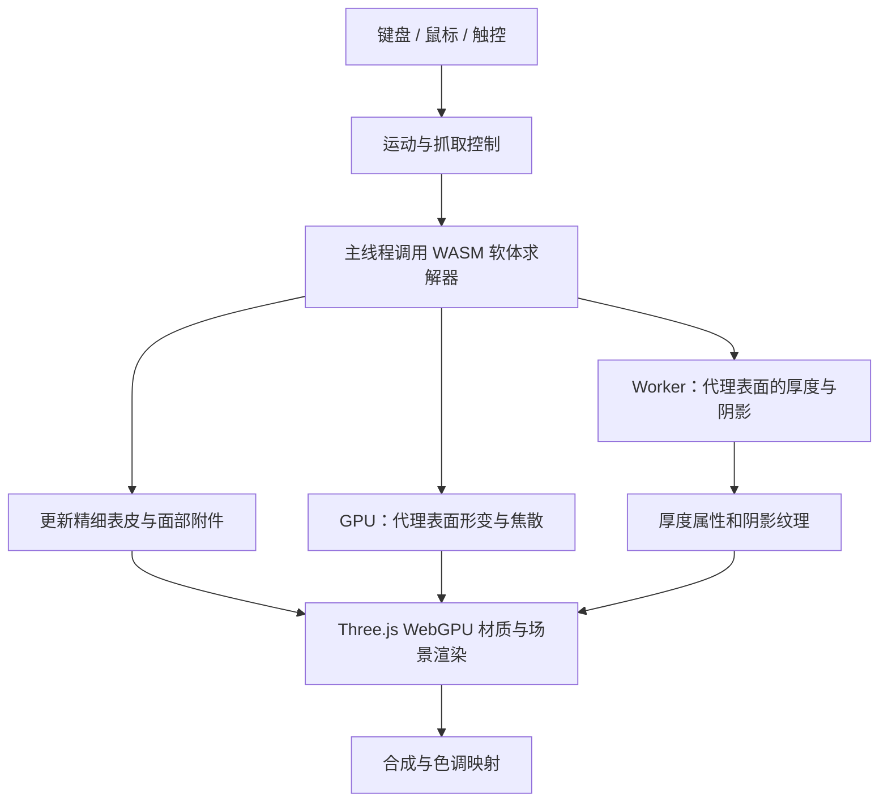

# 002 · Jelly-Baby · 浏览器软体交互研究

> 研究一个以 Three.js / WebGPU 呈现的果冻角色：拆解软体物理、程序化运动、半透明材质和动态焦散，评估其教学、互动展示与组件化价值。

[返回总索引](../../README.md) · [研究过程](notes.md) · [源码证据索引](sources.md) · [网页展示说明](web.md) · [青团三维伙伴扩展](companion/README.md) · [首页项目导览](guide.md) · [上游仓库](https://github.com/scottstts/Jelly-Baby)

## 项目档案

| 项目 | 内容 |
| --- | --- |
| 原仓库 | [scottstts/Jelly-Baby](https://github.com/scottstts/Jelly-Baby) |
| 研究版本 / Commit | [`df52c92a8459286bb287f0849764929e73b4f8ce`](https://github.com/scottstts/Jelly-Baby/commit/df52c92a8459286bb287f0849764929e73b4f8ce) |
| 上游提交时间 | 2026-09-05 23:51 UTC，即北京时间 2026-09-06 07:51 |
| 上游许可证 | 本次检查未发现明确 LICENSE 文件，GitHub API 的 license 字段为空；代码与素材的授权范围待确认 |
| 当前状态 | 阶段整理完成：原版复现、三维伙伴、首页导览与弹性课堂已实现；完整性能与真机兼容验证待开展 |
| 研究开始日期 | 2026-09-06 |
| 本项目 Web 演示 | [静态能力展示页](../../docs/demos/002-jelly-baby/index.html)，包含固定版本原版复现、青团三维伙伴扩展及早期二维原型；已本地验证，静态文件随本仓库提交；线上部署状态单独核验 |
| 本次研究范围 | 源码分析、原版构建与页面交互；只保留必要运行产物，未导入完整上游仓库 |

本文用“源码事实”表示在固定提交中可以定位的实现，用“分析判断”表示据此推导的适用性与建议。已按固定提交构建并在本地浏览器观察三维场景；性能、物理稳定性、手感及设备兼容性仍待系统验证。

## 一句话价值

Jelly-Baby 将软体物理、材质光学与角色交互组合成了一个范围集中的前端应用，适合研究“如何以可控计算成本做出可信的软体体验”。它尚未封装成通用 SDK，也没有完整游戏的关卡与进度体系。

## 网页能力展示

页面按“原库原有能力 → 我们的扩展效果 → 场景、扩展方向与意义”组织。首屏展示固定研究版本的原版三维复现，随后展示接入原库物理求解器的三维伙伴青团，并保留材质定制、拉伸挑战、触碰发声三个早期独立二维原型。最后介绍使用场景、扩展路线、底层原理和对我们的价值。另提供首页项目导览和真实拉伸驱动的弹性课堂。


这是本地浏览器中实际渲染的研究页面截图，嵌入内容来自固定提交的本地构建。更多截图、启动方式与验证范围见 [网页展示说明](web.md) · [青团三维伙伴扩展](companion/README.md) · [首页项目导览](guide.md)。

## 当前成果速览

| 层次 | 已有成果 | 不应混淆的边界 |
| --- | --- | --- |
| 原库能力 | 软体抓取、形变、回弹、行走跳跃、半透明材质与动态焦散 | 单角色应用，尚非通用 SDK；不含 AI 对话和业务流程 |
| 我们的角色扩展 | 青团轮廓、注视眨眼、表情、摸头/戳肚子反应、挥手和庆祝 | 规则与物理驱动的表现，没有自主情绪理解 |
| 首页导览 | 真实项目筛选、收藏、浏览器偏好记忆、状态反馈 | 保存浏览器偏好，不是人格记忆或跨设备账号 |
| 弹性课堂 | 真实拉伸 → 松手 → 恢复判断 → 原理解释与庆祝 | 直观学习原型，不是材料测量或学习成效评估 |
| 后续方向 | 组件接口、参数实验台、自有模型管线、玩法和语音接入 | 尚未实现；本阶段停止新增场景，先归档已有成果 |

对我们的意义：一方面沉淀软体物理与实时图形的实现思路，另一方面验证“项目能力 + 角色引导 + 完成反馈”的组合。系列向导可作为后续设计方向；本次未实现跨项目任务流程，也没有用户研究数据证明留存或情绪价值提升。

演示入口：[原版与扩展](../../docs/demos/002-jelly-baby/index.html) · [弹性课堂](../../docs/demos/002-jelly-baby/lesson/index.html) · [首页项目导览](../../docs/index.html#lab-guide)。

## 1. 能力与边界

| 能力 | 源码中已有的实现 | 使用价值与边界 |
| --- | --- | --- |
| 软体形变 | 拉伸、回弹、阻尼、地面接触与摩擦 | 可表达软糖和凝胶的动态观感；没有自碰撞与撕裂 |
| 抓取与抛掷 | 将选中表面位置映射到物理节点，施加有力上限的约束 | 允许局部拉扯并保留释放动量；极端形变仍需验证 |
| 行走与跳跃 | 节点上的姿态恢复力、步态驱动力和跳跃冲量 | 可形成可控角色；未使用学习式运动控制 |
| 姿态恢复 | 抓取时释放运动驱动，松手后逐步恢复 | 将用户拉扯与角色运动连接起来 |
| 半透明外观 | 物理材质、折射率、粗糙度、清漆层、随厚度变化的吸收 | 适合果冻质感展示；不是经过材料测量校准的模型 |
| 动态焦散 | GPU 上近似计算光穿过物体后落在桌面的聚光亮斑 | 提升材质与环境的一致性；当前接收面是平面 |
| 表面附件 | 面部细节跟随变形表皮，控制透射后的绘制顺序 | 避免表情与身体分离及面部被重复折射 |
| 多种输入 | 键盘、鼠标抓取、视角旋转和缩放、移动端触控 | 输入方式齐全；触控存在不等于移动设备性能已经达标 |
| 声音反馈 | 根据接触生成程序化音效 | 可将视觉、动作与声音连接，不依赖录制音频 |
| 验证基础 | 物理检查、性能相关检查、构建和类型检查脚本 | 有利于后续修改；已有脚本不代表本次已经运行通过 |

证据：[S1 项目说明](sources.md#s1-项目说明与配置)、[S2 物理系统](sources.md#s2-物理系统)、[S3 运动与运行循环](sources.md#s3-运动与运行循环)、[S4 材质与光学](sources.md#s4-材质与光学)。

## 2. 底层原理

### 2.1 同一角色使用三种不同精度的表示

模型元数据中，位置数组每三个数表示一个顶点或节点，四面体索引每四个数表示一个单元，三角形索引每三个数表示一个面。按该布局计算：

| 表示 | 规模 | 负责的工作 |
| --- | --- | --- |
| 内部物理网格 | 980 个节点、4,026 个四面体 | 弹性、体积变化、接触、抓取和运动 |
| 可见表皮 | 72,234 个顶点、144,464 个三角形 | 最终外观、交互选点与面部附件的几何依据 |
| 光学代理表面 | 10,090 个顶点、20,176 个三角形 | 光学厚度、阴影及焦散所用的简化几何 |

精细表皮通过重心权重绑定到四面体。物理节点移动后，表皮位置由对应节点的加权组合更新；法线随变形更新。这里的精细表皮仍在 CPU 侧更新，不能把整个角色描述成仅在着色器里变形。

这种结构将“看起来有多细”和“物理算多少”分开，是值得复用的设计。来源：[S5 模型与绑定](sources.md#s5-模型与绑定)。

### 2.2 软体弹性：neo-Hookean 能量与耦合 XPBD

每个四面体的形变梯度 `F` 表示它相对初始形状的变化，`J = det(F)` 表示相对体积与方向。求解器使用 neo-Hookean 型能量描述变形，并通过 XPBD 迭代修正节点位置。

源码中的能量表达为 `W = μ/2 × (||F||² − 3) + K/2 × (J − 1 − μ/K)²`；计算相对静止状态的弹性能量时另减去常数项。`μ` 与 `K` 分别对应代码的 shear 和 bulk 参数。

拉伸与体积相关约束采用耦合求解，使静止状态的相关作用抵消。接触约束防止穿过桌面，摩擦限制贴地滑动，抓取约束有力上限；阻尼让形变逐渐消散。方向屏障和局部修复用于抑制单元翻转，不应把这些保护描述为任意极端操作下都不会失稳的保证。

固定物理步长为 `1/240 s`，当前每步执行三轮约束迭代。重力设为 `2.4 m/s²`，明显体现了对轻盈手感的取舍。物理步进频率不等于渲染帧率，更不等于已经实测达到 240 FPS。来源：[S2](sources.md#s2-物理系统)。

### 2.3 运动控制：用力驱动姿态

运动控制器为节点计算目标姿态与交替步态，再向速度施加相应变化。跳跃时脚部获得更大的冲量，弹性将运动传递到身体其他部分。

抓取期间运动驱动释放，松手后约 0.55 秒逐步恢复。角色的站立与步行由人工设计的控制器支持，不能据此推断其具有自主学习能力，或把站立表现归结为材料本身的弹性。来源：[S3](sources.md#s3-运动与运行循环)。

### 2.4 材质与光学：厚度决定颜色，折射形成焦散

可见身体使用 `MeshPhysicalNodeMaterial`，结合透射、粗糙度、折射率和清漆层。光学厚度由 Worker 在代理表面上计算，再插值到可见表皮。吸收随内部传播距离累积，因此较厚处颜色更浓，较薄处更通透。

当前 GPU 焦散实现从光源方向生成前后表面的深度图，近似计算光的进入、穿出和落到桌面的位置。着色阶段按面积映射关系估计光束聚集程度，并加入透射与吸收。它采用有限分辨率、聚光强度截断和模糊，因此属于面向实时显示的近似，不能当作完整路径追踪或严格光谱仿真。来源：[S4](sources.md#s4-材质与光学)。

### 2.5 CPU、Worker 与 GPU 如何分工



- **主线程 / WASM**：加速软体求解与完整表皮更新；WebAssembly 本身不意味着多线程或后台执行。不可用时保留 JavaScript 后备求解。
- **Worker**：异步计算光学厚度和阴影/接触场；最多每秒发起 30 次请求，同时只保留一个进行中的请求，避免积压。仅相机变化时可以复用形状相关结果。
- **GPU**：场景渲染与焦散在渲染循环中执行；形状与位置未变时可跳过焦散重算。
- **固定步进**：每帧接纳最多 50 ms 时间，最多补算十二个 `1/240 s` 子步；避免无界追帧，但长卡顿超过接纳范围的时间仍会被舍弃。

来源：[S2](sources.md#s2-物理系统)、[S3](sources.md#s3-运动与运行循环)、[S4](sources.md#s4-材质与光学)。

## 3. 源码与 README 的差异

以下差异均针对本次固定提交，说明研究不能只复述 README。

| 主题 | 上游 README 的描述 | 当前源码 / 检查脚本 |
| --- | --- | --- |
| 焦散的执行位置 | Worker 中计算并先于厚度返回 | `RefractiveLightField` 在 GPU 上生成；Worker 返回阴影与厚度 |
| 焦散模糊 | 没有焦散模糊核 | GPU 路径存在九点模糊，并截断极端聚光强度 |
| 焦散分辨率 | 256² 接收纹理 | 当前焦散目标为 160²；光源深度图为 128²；阴影场仍为 256² |
| 物理补算 | 通常受 8 ms 或六个子步限制 | `FixedStepper` 接纳最多 50 ms，补算上限十二步 |
| 防翻转方式 | 整步回溯 | JavaScript 路径可见局部单元修复与向前一状态回退；WASM 对应行为需继续核对并实测 |

当前验证脚本明确检查焦散从渲染循环更新，以及 Worker 不再发布 CPU 焦散数据；但这类结构检查不等于 GPU 着色器已经在浏览器运行成功。来源：[S1](sources.md#s1-项目说明与配置)、[S2](sources.md#s2-物理系统)、[S3](sources.md#s3-运动与运行循环)、[S6](sources.md#s6-验证脚本)。

## 4. 使用场景与适用条件

以下为我们的分析判断。

| 场景 | 适合程度 | 原因与需要补充的工作 |
| --- | --- | --- |
| 图形学、物理教学 | 高 | 可观察弹性、阻尼、厚度与折射；应增加参数面板和几何调试视图 |
| 创意网页、互动吉祥物 | 高 | 角色外观与直接抓取具有表现力；需组件化、适配宿主页面及控制加载成本 |
| 解压玩具、轻量小游戏 | 高 | 已有抓取、投掷、跳跃等交互；需补玩法目标、关卡和状态管理 |
| 软糖、凝胶产品展示 | 中 | 可展示材质观感；替换模型、重建绑定及重新调参有成本 |
| 多角色软体场景 | 待扩展 | 需增加物体间碰撞，评估求解、表皮更新与光学成本 |
| 工程材料性能预测 | 当前不足 | 缺少材料标定与实验验证，参数及光学模型带有体验导向的近似 |

源码明确要求 WebGPU 和安全上下文（HTTPS 或 localhost），并禁用 WebGL 后备渲染。浏览器、操作系统、显卡和驱动是否满足要求，需要按实际目标设备验证。项目是前端结构，可构建为静态站点；本次没有部署演示。来源：[S7 运行环境](sources.md#s7-运行环境)。

## 5. 可扩展方向

| 优先级 | 方向 | 可交付成果 | 主要难点 |
| --- | --- | --- | --- |
| P0 | 参数实验面板 | 软硬、阻尼、摩擦、重力与材质参数对照 | 区分可即时调整参数与需要重建的数据 |
| P0 | 可观察性 | 四面体显示、体积比、耗时、帧率与重置 | 测量开销不能明显干扰交互 |
| P1 | 可复用组件 | 挂载、销毁、配置、事件回调及宿主尺寸适配 | 解除与全局 DOM、全屏视口、单角色状态的耦合 |
| P1 | 模型制作管线 | 从新模型生成物理网格、绑定和光学代理 | 不能只替换显示网格；还需重建接触、附件与运动配置 |
| P1 | 游戏玩法 | 投掷靶、障碍、收集物和关卡 | 新增碰撞对象与规则，保持输入响应 |
| P1 | 设备与加载优化 | 素材压缩、画质分档、按需更新 | 在可测的视觉差异和性能收益之间取舍 |
| P2 | 多物体、自碰撞、撕裂 | 更丰富的软体交互 | 求解成本、接触稳定性以及拓扑变化后的绑定更新 |
| P2 | GPU 物理 / 更丰富的光学 | 更多角色或更复杂光影 | 并行约束冲突、数据回传，以及新的数值和视觉验证 |

以上是建议，不属于上游已具备的能力。近期优先把现有行为变得可观察、可比较，再评估通用化和更重的物理扩展。

## 6. 对我们研究库的意义

本仓库的目标是理解设计、复现功能、整理结论并提供 Web 实践。Jelly-Baby 适合作为“软体物理与实时图形”方向的研究样本：范围集中，输入与反馈清楚，也具备可定位的求解、渲染和验证模块。

我们可以沉淀三类成果：

1. **原理记录**：解释粗物理网格如何驱动精细外观，以及物理、渲染和后台计算为何采用不同更新节奏。
2. **可重复实验**：用体积保持、形变恢复、拖拽延迟和光影对照支撑判断，避免只留下视觉印象。
3. **可展示的实验台**：在同一页面调整参数、查看内部网格、比较物理行为和渲染成本，让结论可被用户直接观察。

建议后续成果定位为“软体与光学实验台”，先验证单角色交互，再决定是否抽取成通用组件。现阶段对教学与展示的研究价值较高，直接作为产品依赖仍需完成授权核实、浏览器验证与接口整理。

## 7. 本地运行与验证方法

以下是基于上游配置整理的复现步骤。本轮已执行 `npm ci` 和 `npm run build -- --base ./`（含 TypeScript 检查），并通过静态服务器启动构建产物。尚未执行上游物理/性能回归、lint 或 benchmark；详见 [原版构建说明](original-build.md)。

准备独立临时目录或外部工作目录，不把完整上游仓库复制进本研究子目录。需要 Git、npm、支持上游 Vite 版本的现代 Node.js，以及支持 WebGPU 的浏览器。上游脚本使用 `--experimental-strip-types`；本次构建环境为 Node.js 22.15.0、npm 10.9.2。

```sh
git clone https://github.com/scottstts/Jelly-Baby.git
cd Jelly-Baby
git checkout --detach df52c92a8459286bb287f0849764929e73b4f8ce
npm ci
npm run dev
```

打开开发服务器实际输出的 localhost 地址。预期可用键盘移动、空格跳跃，拖拽身体进行拉伸和投掷，拖拽桌面旋转视角，滚轮或双指缩放，R 重置；第一次交互后启动声音。本次已确认三维场景启动并操作重置与抓取；其他行为仍应逐项记录验证。

在上游工作目录中运行检查：

```sh
npm run lint
npm run typecheck
npm run test:physics
npm run test:performance
npm run benchmark
npm run build
```

`test:performance` 包含数值与实现结构的断言；`benchmark` 统计 CPU 耗时。两者都不能替代真实浏览器的 GPU、声音、触控与帧率测试。构建使用 Vite，预期生成 `dist/`；如后续部署到本研究库的子路径，需要检查资源 base 和 Worker URL，验证后再填写演示地址。

## 8. 当前结果与待验证实验

### 已完成

- [x] 固定上游提交，记录许可证检查状态。
- [x] 梳理核心能力、模块分工、模型规模与技术边界。
- [x] 对照 README 和源码，记录焦散及步进描述差异。
- [x] 整理使用场景、扩展方向与研究库的实践价值。
- [x] 提供固定版本的源码证据索引。

- [x] 固定版本原版构建、三维伙伴与首页导览实现。
- [x] 真实模型 2,160 步短程数值检查及浏览器触碰/状态反馈验证。
- [x] 弹性课堂完整操作验证，桌面与窄屏截图归档。

### 待执行

| 实验 | 方法 | 应记录的结果 |
| --- | --- | --- |
| 启动与交互 | 在目标浏览器操作移动、跳跃、抓取、投掷和重置 | OS、浏览器、GPU、错误信息及实际截图 |
| 静置与恢复 | 重置、落地、等待、拉伸后释放 | 体积比、恢复时间、残余抖动与休眠行为 |
| 极端拖拽 | 快速拉伸、突然松手和反复贴地拖动 | 最小 Jacobian、有限值检查、穿透和输入对齐 |
| 性能分解 | 分别测行走、严重拉伸与静止 | CPU 求解/表皮耗时、浏览器帧时间分位数和测试设备 |
| 光学对照 | 固定视角，比较不同形状和厚度 | 焦散跟随、色彩变化、边缘伪影与后台更新延迟 |
| 兼容与加载 | 桌面、触屏和无 WebGPU 环境分别访问 | 启动耗时、下载量、内存、触控体验和故障提示 |
| 生命周期 | 反复挂载、卸载、调整尺寸和切后台 | Worker、渲染循环、事件和 GPU 资源是否妥善释放 |

已完成固定提交构建、浏览器交互检查和扩展模型的 2,160 步短程数值检查；尚无系统性能数据或线上部署验证，不能宣称上游稳定帧率、全设备兼容或所有检查通过。研究页面、本地原版场景与作者在线截图放在 `../../docs/assets/projects/002-jelly-baby/`，分别注明来源和验证范围。

## 来源与复用说明

项目来源为 [scottstts/Jelly-Baby](https://github.com/scottstts/Jelly-Baby)。本子项目保存原创中文分析、固定版本的源码链接和原创展示页；原版必要编译产物及运行素材放在展示页 original 子目录，用于本地研究复现，来源与校验值见构建清单。另保存注明来源的作者在线应用浏览器截图。上游代码、模型、EXR 环境图和纹理的授权需分别核实；当前没有确认到统一许可证，不将其标记为 MIT、Apache 或其他具体许可。

详细证据见 [sources.md](sources.md)，研究过程和验证边界见 [notes.md](notes.md)。

## 单场景体验

[跟青团做一次弹性实验](lesson.md)：真实拉伸、回弹观察与完成反馈，说明项目能力怎样与角色陪伴结合。
