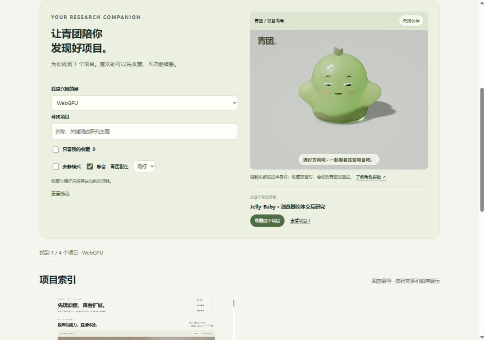
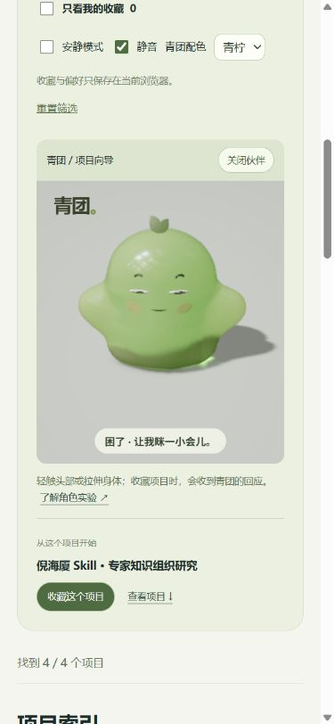

# 青团 · Research Lab 项目导览

入口：站点首页 `index.html#lab-guide`。这是实际项目导览功能，使用登记表中的真实项目，而不是虚构推荐。

## 完整流程

1. 第一次访问：欢迎文案；青团进入可见区域后才加载三维资源，成功启动后欢迎一次。
2. 选择兴趣标签或输入关键词：筛选现有项目，显示结果数；给出第一个匹配项目作为浏览起点，可直接查看或收藏。
3. 收藏：卡片和向导入口同步更新。青团可见时触发完成反馈，庆祝间隔至少 8 秒；角色不在屏幕内时仅显示就近的文字反馈。
4. 再次访问：恢复兴趣、关键词、收藏视图、收藏项目、静音、安静模式、配色和伙伴开关。

所有收藏与偏好只保存在本浏览器 localStorage，不创建账号，不同步到服务端。存储不可用时仍可筛选和临时收藏，并显示不能保存的提示。关键词筛选直接在已生成的卡片中完成，不伪造网络加载步骤。

## 运行与退化路径

- 初始 iframe 没有 src；通过 IntersectionObserver 观察角色区域，进入屏幕后才创建三维场景。
- 离屏或页面隐藏时，通知子页面暂停物理、光学更新与渲染。返回时继续，暂停会清除未完成的庆祝动作，避免回来时意外跳跃。
- 关闭伙伴会卸载 iframe，刷新后继续保持关闭。静态截图和全部项目功能仍可用。
- 缺少 WebGPU 时直接展示真实截图。初始化失败或超过 45 秒时卸载三维页面，显示静态形象与重试入口。
- 安静模式抑制主动姿态与庆祝跳跃，保留眼睛、表情和用户主动触碰。静音默认开启，声音仍需要浏览器允许的用户交互。
- 青柠与蜜桃改变主体材质色彩；焦散仍使用原有近似吸收参数，这不是物理一致的材料配色实验。

## 维护位置

首页由 `scripts/catalog.mjs` 生成，导览片段位于 `scripts/templates/lab-guide.html`。项目 ID、标签与收藏入口随 `projects.json` 同步生成，不硬编码某个项目列表。

交互位于 `docs/assets/lab-guide.js`，样式追加在 `docs/assets/style.css`。修改生成逻辑后执行 `npm run sync` 和 `npm run check`。三维运行时复用 `companion/`，以 `?guide=1` 开启精简导览界面；同源父窗口通过白名单消息配置暂停、静音、配色和安静模式。独立实验页保留全部操作入口。

## 验证记录

实际浏览器已验证：WebGPU 标签筛选仅显示 002；无匹配关键词显示空结果；收藏、取消收藏与仅看收藏；刷新恢复筛选、收藏和偏好；安静与配色配置送达三维页面；离屏暂停、返回恢复；关闭卸载与刷新保持关闭、重新唤醒。

没有在不支持 WebGPU 的真实设备上做兼容性测试；错误退化逻辑已实现，静态截图路径通过关闭场景检查。未测全部浏览器的音频策略、隐私模式与存储限制。

补充验证：1280 px 与 390 px 视口无水平溢出；390 px 首页初次加载时角色位于屏幕外，iframe 尚无 src，滚动到角色后才加载。真实收藏触发三维完成反馈。已取消测试收藏并恢复全部方向、默认静音与青柠配色。原版 13 个文件哈希保持不变。
