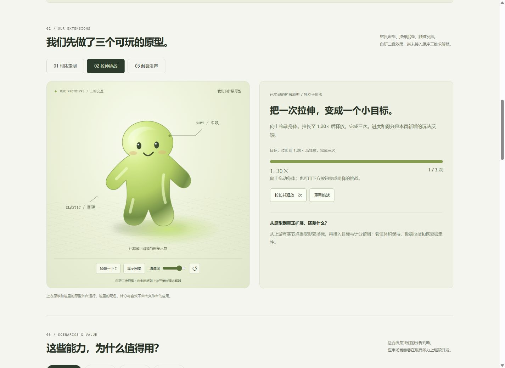
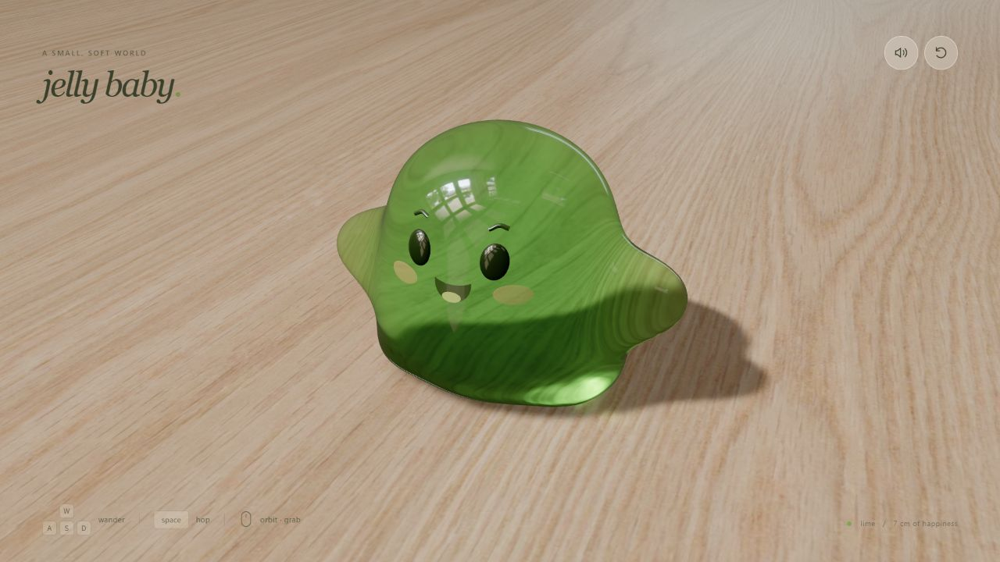
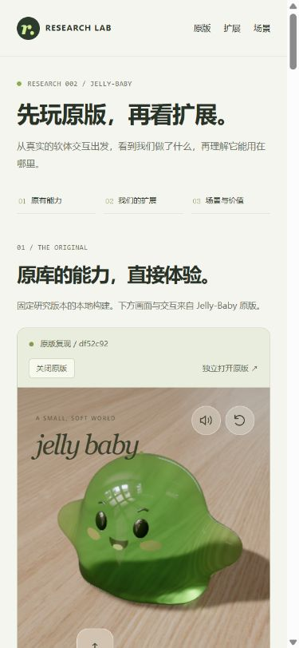
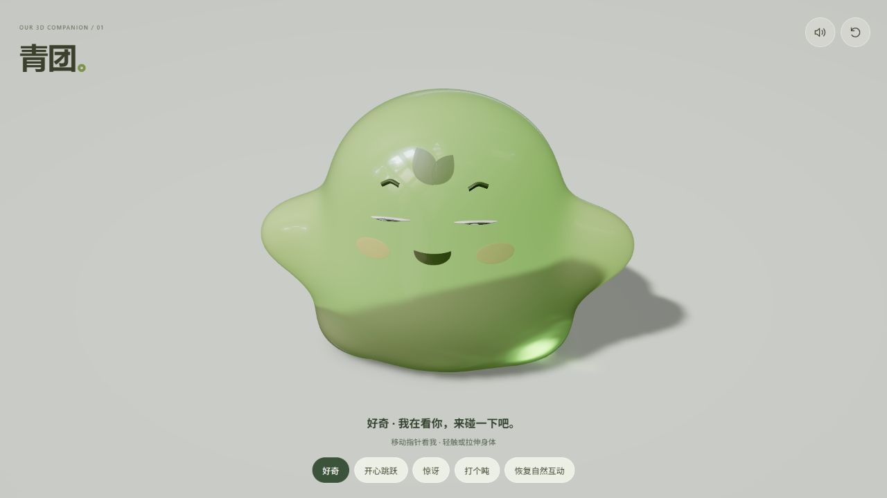
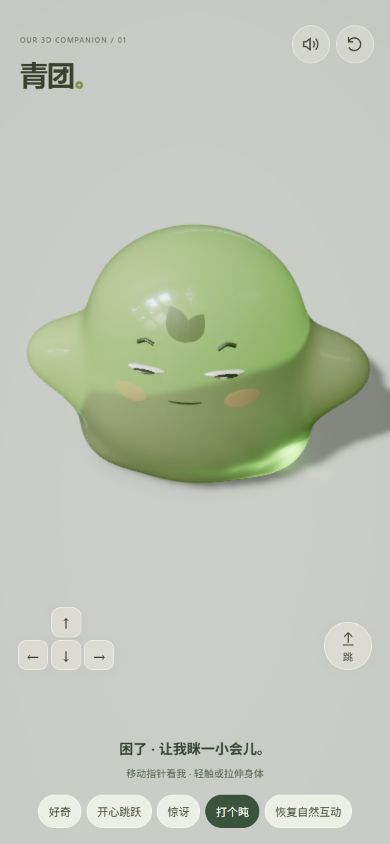
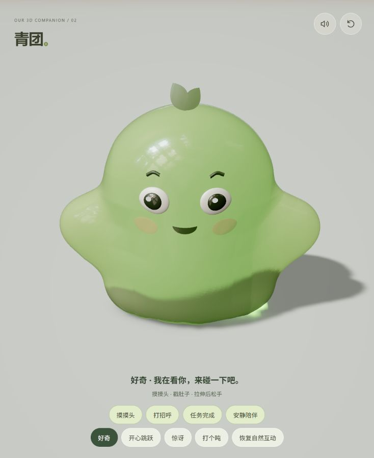
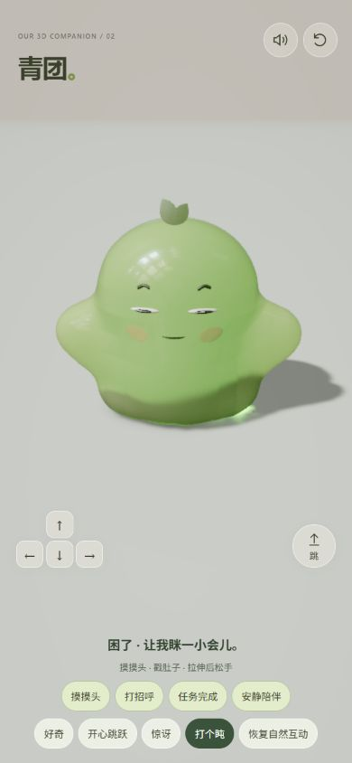
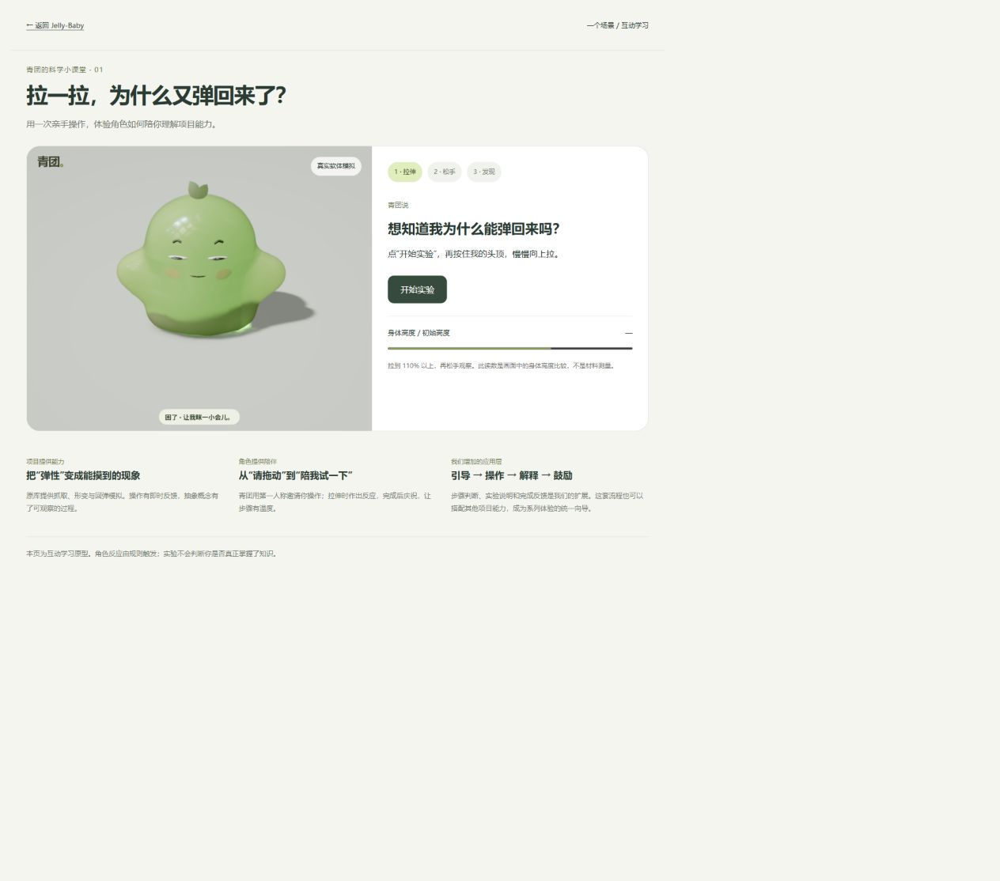

# 002 · Jelly-Baby · 网页展示说明

[返回研究文档](README.md) · [展示页文件](../../docs/demos/002-jelly-baby/index.html)

## 展示顺序

页面按用户指定的顺序组织：**原库原有能力 → 我们的扩展效果 → 场景、扩展方向与意义**。

### 第一部分：原库原有能力

首屏嵌入固定提交的本地构建 `original/`，展示真实三维软体交互，提供中文操作提示、关闭/重新加载和独立打开入口。下方六类能力卡片解释原版的软体形变、抓取抛掷、行走跳跃、材质、焦散及表情声音。

原版按 `df52c92a8459286bb287f0849764929e73b4f8ce` 编译，未修改其运行源码。首版尝试嵌入作者站点，但环境贴图加载出现 Failed to fetch，因此改用同源本地构建。原版仍需 WebGPU；关闭后卸载 iframe，重新加载会重启原版。页面不把 iframe 的 load 事件当成三维启动成功。

### 第二部分：我们的扩展效果

新增主要扩展：**青团——会回应的三维果冻伙伴**。点击“唤醒青团”启动；关闭上方原版，避免两个 WebGPU 场景同时运行。伙伴可关闭并重新启动；切回原版会关闭伙伴。

已接入原库三维求解器，包含大眼睛、独立瞳孔、额饰、四种表情、注视、眨眼和真实抓取/释放反馈。“开心跳跃”由原版物理驱动。更换素色桌面并调整材质与镜头。保留原版身体网格；完整呼吸、挥手、长期性格、语音和具体业务场景尚未实现。

代码、构建和边界见 [三维伙伴说明](companion/README.md)。新实验优先考虑品牌伙伴，再扩展专注陪伴、养成或软体游戏。

早期的三个可操作独立二维原型仍保留，明确标注为早期探索：

| 原型 | 已实现效果 | 迁移到原库需要补充 |
| --- | --- | --- |
| 材质定制 | 三组配色、通透度调整、网格切换与重置 | 将视觉选择映射为上游材质参数，并验证主体和焦散一致性 |
| 拉伸挑战 | 拉长到 1.20× 后释放，完成三次计分；支持按钮替代拖拽 | 使用真实物理节点定义形变指标，接入目标与计分 |
| 触碰发声 | 用户开启后，拉伸程度映射短音音高，轻弹/释放触发声音；可调音量和关闭 | 对接上游接触、速度与形变事件，并校准声音与操作延迟 |

这里使用原创 SVG、二维变换和独立 Web Audio 合成，不运行上游三维求解器，不修改上方原版复现。每个区域均有可见说明，防止将原型当成已完成的上游插件。

### 第三部分：场景、方向与意义

- 六个使用场景，支持学习、品牌、娱乐分类筛选，每个场景说明现有基础、需补齐能力和最小实践。
- 五条长期创意路线，说明实施步骤、改造成本、验证标准和边界。
- 三种用途与三种交互组合成九张可复制的预置实验提案，不调用 AI 服务。
- 用物理网格、精细表皮、光学代理解释技术价值，进一步说明对我们研究库的意义和后续路径。

## 运行与维护

在仓库根目录执行：

```sh
python -m http.server 8765 --directory docs --bind 127.0.0.1
```

打开 [本地展示页](http://127.0.0.1:8765/demos/002-jelly-baby/)。原版首次加载包含模型和纹理，若未成功显示，可通过页面入口独立打开本地原版；二维原型和场景介绍可独立使用。

- 页面：`docs/demos/002-jelly-baby/index.html`。
- 数据及交互：`docs/demos/002-jelly-baby/app.js`。
- 样式：`docs/assets/style.css`，以 `.jelly-page` 限定。
- 截图：`docs/assets/projects/002-jelly-baby/`。

展示页可直接由静态服务器提供。`original/` 保存上游编译后的必要运行资源，约 33.26 MB；不导入上游 Git 历史、参考实验或 node_modules。原版运行不再依赖作者站点的实时资源请求。来源和运行文件 SHA-256 见 [构建清单](build-manifest.json)，许可与复现说明见 [原版构建说明](original-build.md)。

本次没有提交、推送或发布；页尾本研究 GitHub 文档链接需要文件推送后才在远端可访问。部署流程见 [Web 展示与部署](../../guides/deployment.md)。

## 验证范围

第一版已验证六个能力面板、三类筛选、五条路线、九种组合、提案复制及桌面/窄屏排版。第二版重新组织页面，并检查配色变化、挑战计分与重置、音效触发状态以及本地原版嵌入、关闭与重载。新版桌面 1440 × 1050 和窄屏 390 × 844 均无横向溢出；窄屏中原版三维画面正常显示。

2026-09-06 已完成固定提交的 npm ci 和构建（包含 TypeScript 检查），并在页面内观察到真实三维场景及加载层隐藏；操作了重置和抓取。原型挑战的鼠标拖拽记录到 1.30×、1/3 次，按钮可完成三次挑战；换色与短音触发状态正常。这不构成物理精度、稳定帧率或真机兼容性的验证。原型音效验证以音频上下文启动和触发反馈为依据，没有做音质评价。

## 截图

### 当前桌面首屏


### 我们的扩展效果



### 作者在线应用



来源：[jelly.scottsun.io](https://jelly.scottsun.io/)，2026-09-06 实际浏览器截图。没有将其标记为固定提交的复现结果。

### 当前手机首屏




## 青团三维伙伴截图






### 青团本轮验证结果

- TypeScript 检查及 Vite 生产构建通过；仍有约 1 MB 主运行包的体积提示，未进行拆包优化。
- 原版构建清单 13 个文件哈希核验一致，未更改原版。
- 实际 WebGPU 页面：成功启动；四表情按钮；抓取释放后开心反馈；开心按钮真实离地跳跃；12 秒闲置后自动困倦均已观察。
- 主页面：唤醒伙伴关闭原版，关闭/重启伙伴、重新打开原版关闭伙伴均通过。
- 390 × 844 视口：角色、触控与表情按钮可见，无水平溢出。仅模拟窄屏，未验证手机真机性能。
- 初次测试发现共享 EXR 资源路径 404，已修正构建路径并重新加载验证。浏览器日志中另有一条无法定位来源的 MutationObserver 错误，发生于页面切换阶段；最终启动与交互未受阻，不据此宣称全部控制台日志无错。


## 青团 02 · 全身回应与品牌页面联动

本版在原拓扑上收窄躯干、拉高轮廓，并同步重算物理节点、静止体积、表皮和法线；头顶叶芽形成更鲜明的轮廓。新增摸头眯眼侧倾、戳肚子缩身、拉伸后晃动恢复、打招呼挥手、完成任务蓄力跳跃。表情平滑过渡，待机时有微幅姿态变化。

扩展区的“访客进入 / 处理中 / 任务完成”按钮通过同源父页面消息触发相同动作。原版仍是首段内容，并保持文件不变。早期二维原型继续保留；上一版说明及截图代表历史验证结果。


### 第二版验证与截图

- 生产构建与 TypeScript 检查通过。
- 4,026 个静止四面体均未翻转，最小新旧有向体积比 0.8686。真实求解器完成 2,160 步姿态/跳跃/重置检查，姿态阶段最小 Jacobian 约 0.4065，未出现非有限状态或翻转。
- 浏览器验证：轻触头部、戳肚子与真实拖拽释放分别出现对应反馈；同源父页面欢迎、等待、完成事件均收到并切换动作。
- 窄屏镜头独立保持较正面的视角，避免原版按宽高比强制俯视；两排反应按钮与触控方向键分开布局。
- 此轮是短程稳定性与可用性检查，尚未覆盖长时间极端拉扯、真机性能和全部视角。






## 首页项目导览

青团已接入 Research Lab 首页真实项目索引，支持标签和关键词筛选、收藏及收藏视图、偏好记忆、安静/静音/配色设置。按可见性加载与暂停，失败时显示真实静态截图。实现边界和验证记录见 [项目导览说明](guide.md)。

## 弹性课堂场景

[打开课堂](../../docs/demos/002-jelly-baby/lesson/index.html)。用户开始实验、抓头向上拉、松手观察恢复，页面根据实际物理状态显示解释并触发庆祝。实现与验证边界见 [场景说明](lesson.md)。




