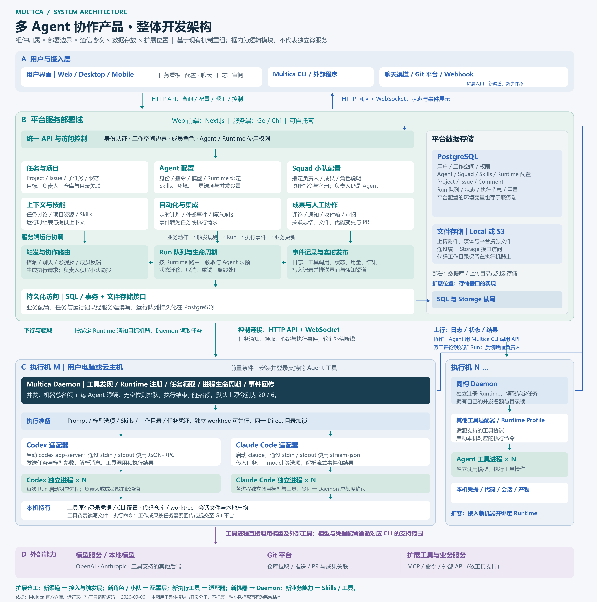
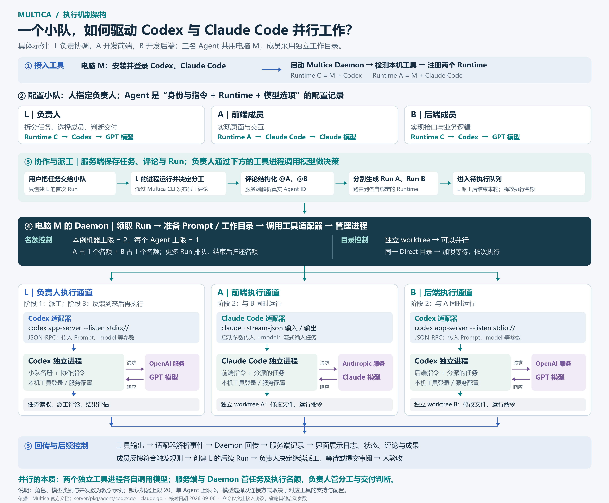
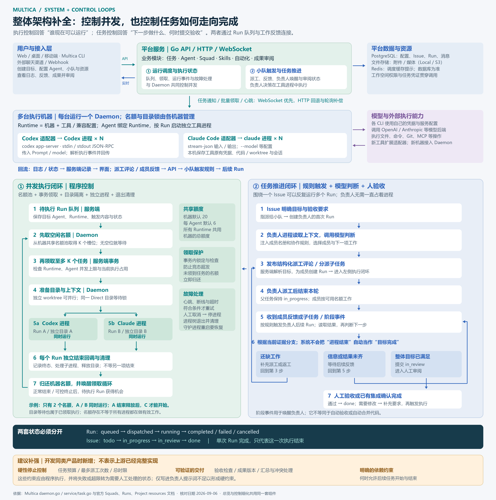

# 架构、并发与任务推进

[项目总览](README.md) · [证据索引](sources.md)

## 1. 系统边界

| 区域 | 组件 | 通信与数据 |
| --- | --- | --- |
| 用户入口 | Web、桌面、移动端、CLI、渠道 | HTTP API 操作，实时连接更新界面 |
| 平台服务 | Go / Chi；任务、Agent、小队、Skills、自动化、协作触发、Run 管理 | PostgreSQL 保存配置、队列、任务、评论、执行记录；Local / S3 保存附件 |
| 调度支持 | Redis 缓存提示 | 辅助空队列与恢复检查，数据库仍是状态依据 |
| 执行机 | Daemon 检测、注册、领取、准备、并发与进程管理 | WebSocket 优先的领取与通知，HTTP 回退及轮询补偿，回传事件 |
| 工具进程 | Codex、Claude Code 等 | 使用工具认证调用模型，操作代码目录、命令与其他工具 |

模块是逻辑划分，不要求独立微服务。工具原有登录凭据、代码与会话在执行机；平台保存的 custom_env 等配置则存在服务端，不能把本地执行解释为所有信息都不离开机器。

## 2. 对象关系

| 对象 | 含义 |
| --- | --- |
| Agent | 长期身份、职责、工具与模型配置，绑定 Runtime |
| Runtime | 一台机器上的工具或兼容配置，可被多个 Agent 复用 |
| Issue | 整体目标、讨论、负责人及交付状态，可关联多次执行 |
| Run | 一个 Agent 的一次执行，记录触发原因、进度与终态 |
| Squad | 负责人、成员名册与协作规则；负责人由人指定 |

## 3. 工具与模型接入

先在执行机安装并登录工具，Daemon 检测并注册 Runtime；Agent 绑定 Runtime，并选择工具支持的模型与执行选项。模型留空使用工具默认配置，部分工具自行管理模型。

| 适配器 | 实际方式 |
| --- | --- |
| Codex | 启动 `codex app-server --listen stdio://`，标准输入输出上的 JSON-RPC；发起 / 恢复会话与回合，传入 model 等参数 |
| Claude Code | 启动 claude，以 stream-json 收发；传入 --model 等选项，解析流式消息、控制请求、用量与结果 |

这些命令只突出协议，不是完整生产启动指令。Custom Runtime Profile 复用已支持协议族；任意配置一个命令不会自动增加新协议。新工具可在适配层扩展，模型实际连接由对应 CLI 承担。

## 4. 并发：名额、领取、目录与独立进程

Daemon 的 runBatchPoller 先从缓冲 channel 名额池取得 K 个槽位，再向服务端请求最多 K 个任务。同一机器的不同 Runtime 共用机器额度。默认机器上限 20、单 Agent 上限 6；它们是可配置上限，不代表总有这么多任务运行。

服务端在事务中锁定 Agent，检查 Runtime 和占用后领取任务。Daemon 为各任务启动独立处理逻辑与工具进程。未领到任务的预留槽位归还；已执行任务在终态回调和本地清理后归还名额，并唤醒下一轮领取。

能并行需要同时满足：目标 Runtime 可用、机器与 Agent 名额可用、上下文串行约束允许，以及目录可用。独立 worktree 支持并行；同一真实 Direct 目录等待锁。

目录等待发生在领取后，因此可能占用槽位。worktree 不是通用操作系统沙箱，也不会自动解决最终合并冲突。例：2 个名额供 A / B 同时运行，C 排队；A 结束并清理后 C 可开始，无需等 B。

## 5. 任务推进：负责人决策与事件循环

1. Issue 指派小队，先触发负责人 Run。
2. 负责人获得操作规则、名册与小队指令，调用模型判断分工。
3. 经 Multica CLI 发布带结构化 Agent 提及的评论，服务端解析后为成员创建 Run。
4. 负责人派工后结束本轮；父任务仍在 in_progress。
5. 成员反馈或子任务 / 阶段事件满足规则时触发负责人后续 Run。重复待处理反馈可能合并，并非每条消息无条件启动新进程。
6. 负责人判断还缺工作、应等待还是可提交 in_review。
7. 人工或已有集成确认 done；有修改要求则再触发执行。

“回调”更准确地说是事件与业务反馈。它们通过长期记录连接多个执行回合，不是必须调用一个常驻 leader 函数。负责人决定做什么，程序记录事实并管理执行机会。

## 6. 两套状态及异常边界

| 对象 | 常见状态路径 | 含义 |
| --- | --- | --- |
| Run | queued → dispatched → running → completed / failed / cancelled | 一次执行正常结束不代表整体完成 |
| Issue | todo → in_progress → in_review → done | 整体工作推进，表格不是所有状态的穷举 |

还有 deferred、waiting_local_directory 等执行状态。修改 Issue 负责人或状态不等于停止已开始的 Run。部分基础设施或连接错误有自动重试条件，配额、凭据和模型无法完成不能一概自动重试。阶段事件可以唤醒负责人，不会自动证明成果正确。

## 7. 同类产品的开发启示

系统图可指导模块划分、部署和扩展位置。执行控制与目标推进分别实现，通过持久化记录、事件、成果关联衔接。负责人走普通 Agent 执行通道；不要把示例中的前端 / 后端角色组合写死。

以下是建议，不宣称上游已完整实现：

- 程序强制总预算、总时限、派工和重试次数，超限转人工处理。
- 可执行验收、成果与代码版本绑定、汇总与合并策略。
- 依赖约束、失败和取消传播、重复副作用处理。

仅靠提示词“直到完成”“不要无限循环”不足以形成硬约束。
