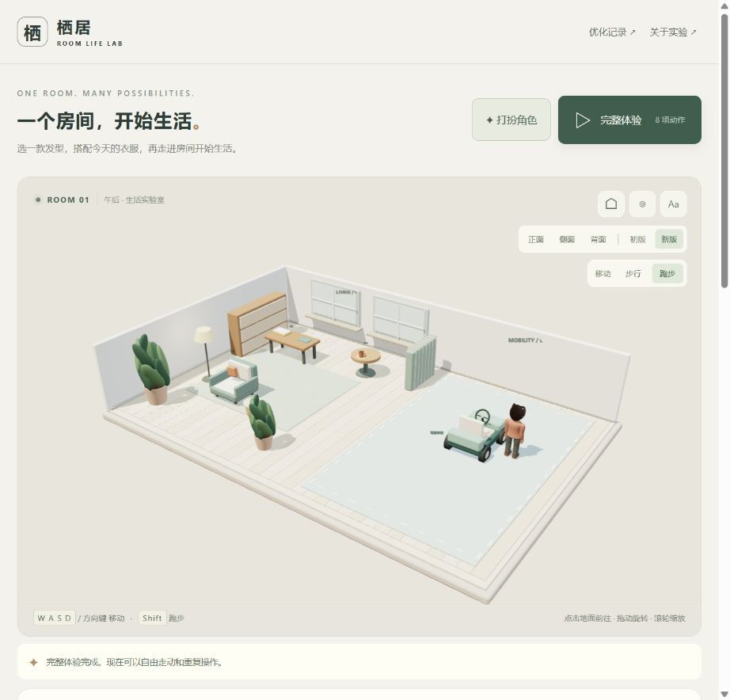
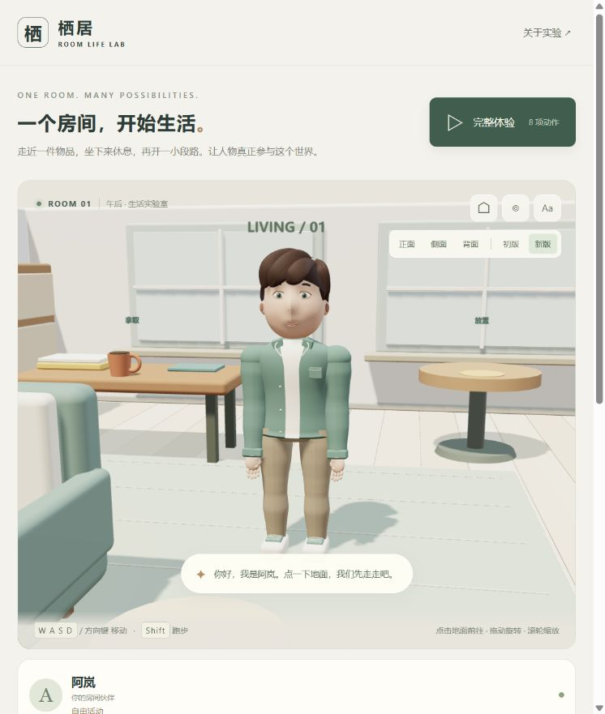
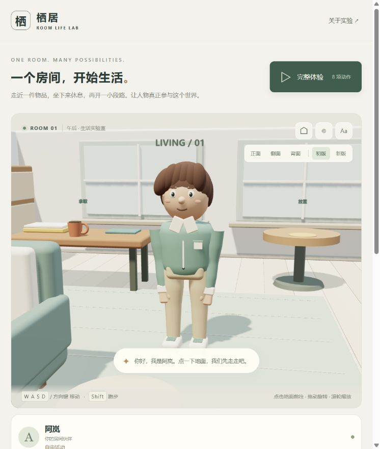
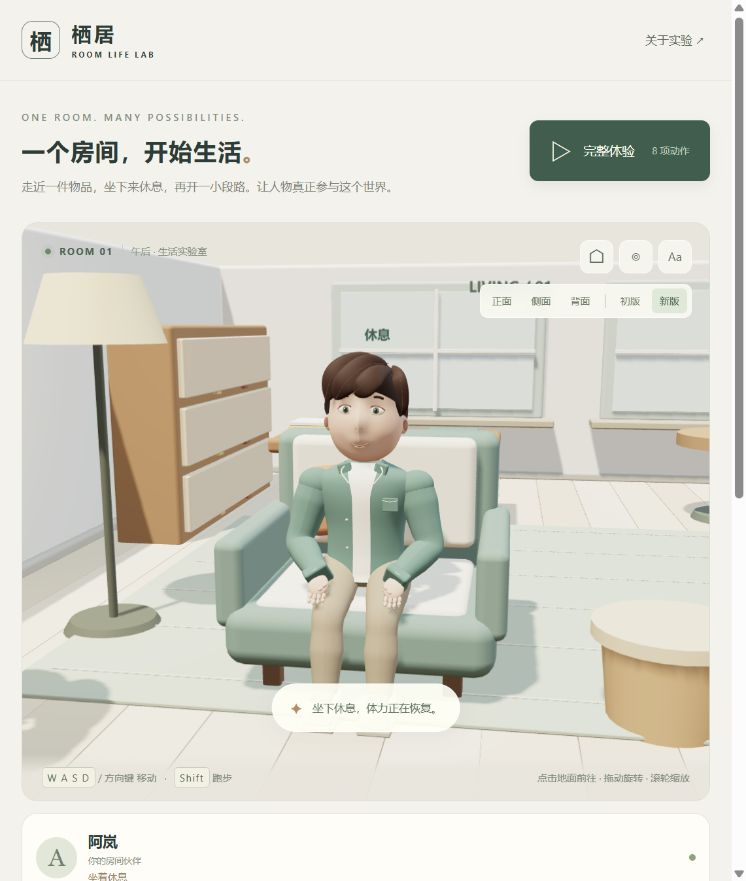
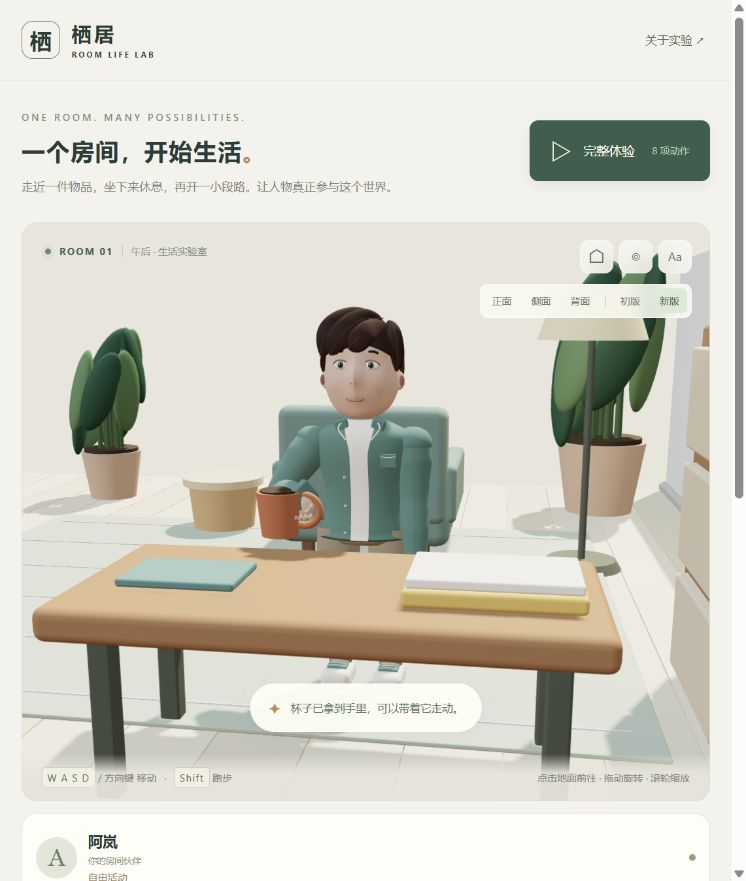
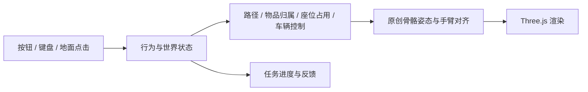

# 005 · 栖居 · 原创人物生活交互实验室

自行制作一个人物和一个房间，验证走动、拿取、搬运、放置、坐起和驾驶的连续行为。当前交付为可操作的浏览器原型，默认展示 2026-09-07 优化后的阿岚 V2，并提供原创角色衣橱。

[返回总索引](../../README.md) · [演示页面](../../docs/demos/005-room-life/index.html) · [研究与验证](notes.md) · [动作排查](motion-audit.md) · [优化记录](optimization-log.md) · [网页记录](../../docs/demos/005-room-life/updates.html) · [产品化路线](product-plan.md) · [写实人物设计](character-design.md) · [原库能力](upstream-capabilities.md) · [遗留说明](handoff.md)

## 原库、我们的扩展与当前边界

| 范围 | 能力说明 |
| --- | --- |
| 原库 Nova3D | 官方定位是文字或参考图片驱动的结构化三维生成：Blender Python 构造、命名部件、层级与材质；公开 Web 客户端、MCP 和 Blender 插件，生成后端仍为托管闭源服务 |
| 我们的扩展 | 从“生成资产”进一步研究“角色如何参与生活”，独立自制人物、房间、衣橱和行为规则；不是原库 Fork，也未接入其生成服务 |
| 已实现 | 八项生活交互、走跑和接触约束、有限形象定制及浏览器保存、V1 留档对比、优化记录网页 |
| 遗留待扩展 | 照片级写实数字人、通用换装与精细接触、手机性能验收、多套角色与世界存档、长期养成和自然语言交互 |

上游能力基于 [Nova3D 固定版本官方说明](https://github.com/RareSense/Nova3D/blob/2299e02d57e513966afaa8cfcc510e8c01110dd7/README.md) 整理，未实测其托管生成效果。详细区分见 [原库能力与关系](upstream-capabilities.md)。

## 图片引导：先打扮，再开始生活

[打开在线演示](https://yydshly.github.io/0906_codex_project/demos/005-room-life/) · [在线优化记录](https://yydshly.github.io/0906_codex_project/demos/005-room-life/updates.html) · [完整遗留清单](handoff.md)

**1. 点击「打扮角色」选择发型、衣服与配色，保存后刷新恢复。**


**2. 点击「查看形象」，从正、侧、背观察；下面是针织上装和齐耳短发的实际搭配。**


**3. 点击「完整体验」完成八项行为，也可单独操作任务。下面是体验完成后的真实房间画面。**



以上为真实截图引导，不是视频或 AI 概念图。单帧用于展示界面与外观，动作连续性需通过在线演示及验证记录判断。

## 最新目标

用户已明确期望接近摄影效果的写实数字人。当前 V2 是风格化功能原型，尚未达到这一目标；后续先制作写实人物设计包和实时头肩样板，再接入全身、换装与房间动作。详见 [优化路线](product-plan.md) 和 [人物形象设计方案](character-design.md)。

## 人物版本与保存

- **优化形象 V2**：连续脸型、重新设计的侧分头发、调整后的身体比例、随骨骼弯曲的躯干与衣服、五指关节、支撑脚锚点和简单神态预设。
- **初版形象 V1**：页面内点击「初版」即可在同一场景和镜头中对比，物品和动作状态保持不变。
- **初版完整留档**：[冻结的第一版演示](../../docs/demos/005-room-life/versions/v1/index.html)；保留当时全部界面、人物、动作和镜头。
- **源码与截图备份**：[留档及恢复说明](snapshots/README.md)。22 个原始文件有 SHA-256 校验记录，测试会检查留档未被后续修改。

观察按钮提供正面、侧面、背面；窄窗口中也可直接在画面内切换版本和视角。镜头绕到墙外时自动剖开遮挡墙体及相应装饰，便于检查靠墙人物。

## 打扮角色

页面顶部「打扮角色」打开衣橱，提供三种发型、两种脸型、两种上装、两种裤装、两种鞋型，以及肤色、发色和穿搭配色。选择后立即试穿，「查看形象」回到近景。

点击「保存形象」保存在当前浏览器，下次打开自动恢复；「恢复已保存」放弃本次试穿，「默认搭配」先预览默认形象，保存后才覆盖之前的搭配。重新开始房间不清除形象。初版 V1 保持原样，衣橱仅用于 V2。

这是有限预设组合，不包含自由捏脸、体型编辑或跨设备同步。真实截图和验证见 [O12 优化记录](optimization-log.md)。

## 项目档案

| 项目 | 内容 |
| --- | --- |
| 类型 | 本仓库原创子项目，编号 005 永久保留 |
| 源码仓库 | https://github.com/yydshly/0906_codex_project |
| 研究日期 / 版本 | 2026-09-07，V2 工作区；基于本仓库提交 `22376ecd033a00404d9ed311437759d8fd059f46`，源码及静态构建随本仓库提交发布，具体状态见 Git 历史 |
| 讨论参考 | [Nova3D](https://github.com/RareSense/Nova3D)；仅为最初问题来源，未复用其代码或服务 |
| 参考研究版本 | Nova3D `2299e02d57e513966afaa8cfcc510e8c01110dd7`，不属于本项目运行依赖 |
| 依赖 | Three.js `0.180.0`，MIT；构建工具 esbuild `0.25.10`，MIT；记录页构建 marked `18.0.11`，MIT |
| 自有内容许可证 | 本仓库尚未声明独立开源许可证；第三方 MIT 不自动成为原创内容许可证 |
| 状态 | 研究中：限定场景的功能原型，已完成首轮人物造型与姿态优化，接触细节仍待迭代 |
| 部署 | 静态页面，无后端、无 API 密钥、无运行时模型下载 |

## 历史对照画面（早期 V2）



人物、家具、杯子、小车均由本项目代码建立；左侧为生活区，右侧为有限范围驾驶区。



上图为同一镜头中切回初版后的真实画面。初版原始截图另存于 `docs/assets/projects/005-room-life/v1/`，未覆盖。两版人物、服装、面部和头发均由本项目制作。





## 当前能力

| 能力 | 实现 | 边界 |
| --- | --- | --- |
| 行走、跑步 | 点击地面寻路；WASD / 方向键移动，Shift 跑步，避开家具 | 单角色、平地、固定布局 |
| 拿取、持物 | 接近杯子、手臂对齐把手；交接后杯子跟随手部，持物可移动 | 一个预设杯子，五指采用预设弯曲角度，未做逐指碰撞求解 |
| 放置 | 搬运到圆形边桌，交接时释放手部归属；支持再次拿取 | 预设放置位置 |
| 坐下、起身 | 对齐座位、落座、休息恢复体力、起身释放占用 | 一张匹配当前角色比例的椅子 |
| 上车、驾驶、下车 | 控制权切到小车；前进、倒车、转向、边界停车；下车前减速 | 简化平面车辆模型；短程体验走直线，上下车为简化过渡 |
| 连续体验 | 一键串联八项动作；也可单独重复操作、停止、重置 | 固定任务序列，未接入大模型 |

## 本地运行

已使用 Windows、Node.js `v22.15.0`、Python `3.10.11` 运行。从仓库根目录执行：

```powershell
cd projects/005-room-life
npm ci
npm test
npm run build
cd ../..
python -m http.server 8766 --bind 127.0.0.1 --directory docs
```

打开 http://127.0.0.1:8766/demos/005-room-life/ 。构建产物已保存到静态发布目录；只体验时可直接启动静态服务器。模块脚本不能直接以 `file://` 打开。

需要支持 WebGL 的浏览器。点击「完整体验」串联八项动作；「◎」切换人物近景，「⌂」回到全景。画面内「步行 / 跑步」控制前往目的地的速度，移动中也可切换；键盘仍支持按住 Shift 跑步，重新开始恢复步行。拖动旋转、滚轮缩放；小屏幕提供触控方向键。页面隐藏时暂停推进。构建后运行不需要资产 CDN。

## 实现分工



- [simulation.js](src/simulation.js)：纯逻辑世界、网格寻路、前置条件、归属、占用和驾驶。取消动作时维持一致状态。
- [character.js](src/character.js)：原创曲面、39 根骨骼、躯干与四肢蒙皮、五指、程序化步态和两段肢体求解；显式指定肘膝弯曲方向，手部实际位置驱动杯子。
- [character-geometry.js](src/character-geometry.js)：轮廓曲面、发束、顶点颜色和蒙皮权重生成。
- [running-gait.js](src/running-gait.js)：独立跑步周期，包含后腿回收曲线、腾空与落地重心变化；人物实现负责前掌接触及腿部求解。
- [walking-gait.js](src/walking-gait.js)：步行支撑腿伸展、抬跟离地、屈膝回收和落地前伸展的独立周期。
- [rest-footwork.js](src/rest-footwork.js)：停步和静止调整朝向时逐脚落位，保留另一只脚的位置及方向。
- [body-motion.js](src/body-motion.js)：根据加减速与转向变化叠加躯干倾斜、肩胯差异和头部补偿；持物时减幅。
- [ground.js](src/ground.js)：木地板、地毯和驾驶区的共享表面高度，同时用于场景渲染和人物接地。
- [character-v1.js](src/character-v1.js)：与留档逐字节一致的初版人物实现。
- [view.js](src/view.js)：房间、车辆、光照、镜头和显示。
- [appearance.js](src/appearance.js)：有限部件与配色配置、输入校验和浏览器存储。
- [main.js](src/main.js)：输入、循环、任务反馈、衣橱控制和窗口适配。
- [tests/simulation.test.mjs](tests/simulation.test.mjs)：连续任务、归属、取消、寻路和车辆边界验证。
- [tests/locomotion.test.mjs](tests/locomotion.test.mjs)：从第一帧检查八方向起步、短停重启、反向、走跑切换、随机连续输入及实际表面接地。
- [tests/body-motion.test.mjs](tests/body-motion.test.mjs)：加减速身体反应、左右转弯、复位、持杯稳定及交互优先级。
- [build.mjs](build.mjs)：打包到静态目录，保留第三方许可证。
- [build-records.mjs](build-records.mjs)：从 Markdown 生成记录网页、目录和历史卡片，映射证据链接并校验本地目标；样式维护在 [records.css](src/records.css)。

## 验证与局限

当前运行基线是 O12 原创部件衣橱与形象保存；O13 整理了写实目标和后续路线，本次补齐发布总览及遗留说明。各轮「优化了什么、为什么修改、如何验证、还差什么」统一维护在 [优化记录](optimization-log.md)，历史测量和截图保留在详细实验记录中。

三十五项自动化测试通过；新增存储异常、换装资源复用与六组搭配生活流程检查，包含新旧模型兼容、蒙皮有效性、不同帧率下的步行接触及支撑腿伸展、跑步双脚离地与后腿回收、前掌蹬地和鞋底防穿地、步行前后摆臂及手掌朝向、手脚协调、走跑切换过渡、持杯走跑、后脑发面覆盖与留档完整性；包含从第一帧开始的 84 组起步与过渡场景，以及累计 90 秒随机连续输入。步行分别检查左右腿「支撑伸展—屈膝回收—落地伸展」，并以鞋跟或前掌接触点验证脚掌滚动；24 组立即停步场景检查逐脚收步和固定脚的位置、方向，以及连续转弯的相位连续性。新增松键减速距离、短末段到达及靠墙制动检查，并验证减速后恢复站姿和放松手臂。真实浏览器中完整流程达到 `8 / 8`。松键、跑步切回步行和接近目的地会渐进减速，低速时缩小步幅与摆臂；「停止任务」仍立即响应。详见 [动作排查](motion-audit.md) 和 [历史验证记录](notes.md)。这个结果说明限定角色、物品和房间的行为闭环可运行，不代表通用人物生成或任意物品交互已经实现。

当前是风格化原型。已改善平地直线行走的接触，但转弯、坐起和上下车还不是完整的接触动画。五指能弯曲，尚未针对每个指节求解接触；肩部蒙皮和衣物层叠也仍可打磨。神态按钮是眼眉、嘴角的简单预设变化，未建立完整面部表情系统。全身关节限制、布料、头发动态、精细上下车动作尚未完成。没有多角色避让、世界存档、多套角色档案、对话、关系养成或实时物理抓握；车辆没有悬挂、轮胎摩擦或碰撞冲量。未做手机实机帧率和低端设备性能验收。

## 来源与许可证

人物、房间、车辆、物品和程序化动作由本项目编写，没有使用下载的人物、贴图、动作包或动作捕捉片段。Three.js 是通用图形依赖，保留 [MIT 许可证](../../docs/demos/005-room-life/assets/three-LICENSE.txt)。Nova3D 是讨论参考，不是本项目上游代码。
