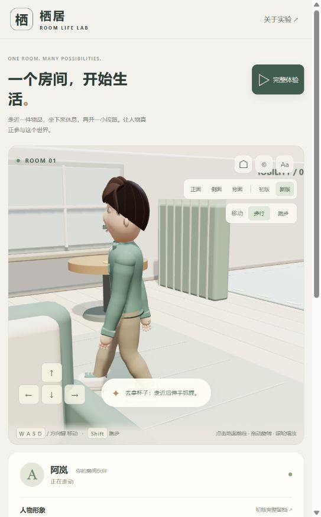

# 2026-09-07 · 起步下跪与连续动作排查

本轮针对 V2 的第一步跨步过大、短暂停止后再走下跪，以及转向和生活动作的连续性进行排查。实际浏览器复现了停止后反向移动时的深度屈膝；问题来自移动状态与落脚状态不同步，不能只靠抬高骨盆解决。

后续又修正了稳定步行的伸屈节奏、逐脚收步、转弯连续性、松键和到达减速，并加入肩胯与躯干配合；最新为 32 项测试。详情见 [历轮优化索引](optimization-log.md) 和 [后续动作验证记录](notes.md)。下文保留起步排查当时的测量与结论。

## 已定位和修复

| 问题 | 原因 | 本轮处理 |
| --- | --- | --- |
| 短停再走时腿被拉开 | 旧步态要等运动权重衰减后才清空，短暂停顿仍保留上一次的支撑脚位置 | 每次重新移动都从上一帧实际脚位建立新步态，不复用旧落点 |
| 第一步突然迈到远处 | 初始相位已经处于摆腿中段，直接套用完整周期轨迹 | 将首步剩余相位重新映射，从实际脚位短时间过渡；步幅随起步距离逐渐增加 |
| 反向时身体先冲出去 | 位移立即达到巡航速度，身体朝向尚未跟上 | 从静止逐渐加速，并按身体朝向与目标方向的一致程度限制位移；键盘和寻路共用这套处理 |
| 连续急转仍会压低骨盆 | 新移动方向与旧支撑脚位置分离，目标脚超出腿部可达范围 | 显著转向时重新规划短步；极端情况下收回不可达落点，避免用骨盆大幅下沉换取接地 |
| 顶墙时原地走 | 分轴碰撞处理把未发生位移也计为移动 | 按实际位移计算速度、运动状态和任务进度 |
| 鞋底埋入不同区域 | 脚部使用统一的旧地面高度，渲染的木地板、地毯、驾驶区却有不同高度 | 渲染和落脚共用表面数据，按鞋跟、鞋中部、鞋尖检查接地；站姿和交互姿态也适配实际表面 |

木地板、地毯、驾驶区顶面分别为 0.0475、0.0775、0.076 m。旧脚底参考面为 0.044 m，在后两个区域会出现约 3 cm 的埋入。新实现同时处理人物根部高度与倾斜鞋底，避免只修脚踝却仍让鞋尖穿地。

可达性保护调整的是脚目标，而非强制抬起骨盆后任由脚悬空。它属于程序化动作的保护措施，极端转向仍可能产生纠正性脚部滑动，并不等于完整的物理接触或转身动画。

## 验证结果

- 修改前的复现样本中，20 fps 下短停 0.05 秒后反向步行，骨盆最低约为 **0.508 m**，明显低于站立基准 **0.94 m**。
- 修改后的逐帧检查要求骨盆局部高度不低于 **0.86 m**，实际脚位置距离求解目标小于 **2 mm**，鞋底不得低于所在表面超过 **2 mm**；以下压力场景全部通过。这些是当前模型的工程阈值，不是人体运动学认证。
- **48 组起步场景**：八个方向 × 步行/跑步 × 20/30/60 fps。
- **36 组过渡场景**：24 组短停反向、6 组连续折返、6 组走跑切换，包含 0.05、0.15、0.3、0.6 秒暂停。
- **累计 90 秒可复现随机输入**：三个帧率各 30 秒，混合停走、八方向急转和速度变化。
- 木地板、地毯、驾驶区分别检查站姿鞋底高度，并保留原有稳态行走、跑步腾空、前后摆臂、持杯、任务归属及 V1 留档完整性检查；共 **23 项自动化测试通过**。
- 静态构建与仓库项目校验通过。最新构建在实际浏览器中启动完整体验并切为跑步后完成 **8 / 8**；杯子回到边桌，座位与车辆占用释放，浏览器 error / warn 记录为空。

此前部分步态测试跳过了最初约三分之一秒至半秒，用于检查稳定周期，因此漏掉了起步和短停重启问题。本轮新增的 [locomotion.test.mjs](tests/locomotion.test.mjs) 从第一帧开始检查，并覆盖整个停走过程。

上图记录修正后的一帧转向起步；静态截图不能证明完整动作连续性，需结合逐帧检查和页面实际操作。窄窗口中提示条会遮挡部分脚部，也属于后续观察体验的改进点。

## 尚未解决的品质边界

以下是当前实现仍存在的限制；并非本轮完整体验失败。

| 优先级 | 现状与风险 | 后续方向 |
| --- | --- | --- |
| 高 | 急转依靠短步重规划与可达性保护，可能有脚部微滑；缺少完整的支撑脚转身与制动动作 | 独立制作起步、制动、原地转身和小半径转弯，约束脚掌接触并协调重心 |
| 高 | 坐起和上下车仍采用简化位置插值，没有通用全身环境碰撞约束；靠家具、车体时存在穿插风险 | 为各阶段设置脚、手、臀部接触点与通过空间，逐段检查四肢和躯干路径 |
| 中 | 接地数据仅覆盖三个平面区域，不支持任意楼梯、斜坡、家具表面或渲染网格；装饰线不是物理地形 | 接入表面采样、法线与跨台阶规划，再增加相应测试 |
| 中 | 抓握针对杯把和方向盘预设，手臂无通用避障、手指无逐指碰撞 | 扩展物品抓握点、手型和手指接触求解 |
| 中 | 肩部蒙皮、衣物层叠、发丝动态和面部细节仍是风格化原型水平 | 分别细化模型、变形和材质，建立近景品质验收 |
| 中 | 未完成手机实机、低端设备和跨浏览器性能验收 | 记录目标设备帧率、卡顿与触控表现；改善小窗口对脚部的遮挡 |

下一轮最值得先做的是转身与停步接触，然后细化坐起、上下车。继续增大步幅或摆臂幅度无法替代这些动作阶段的设计。
