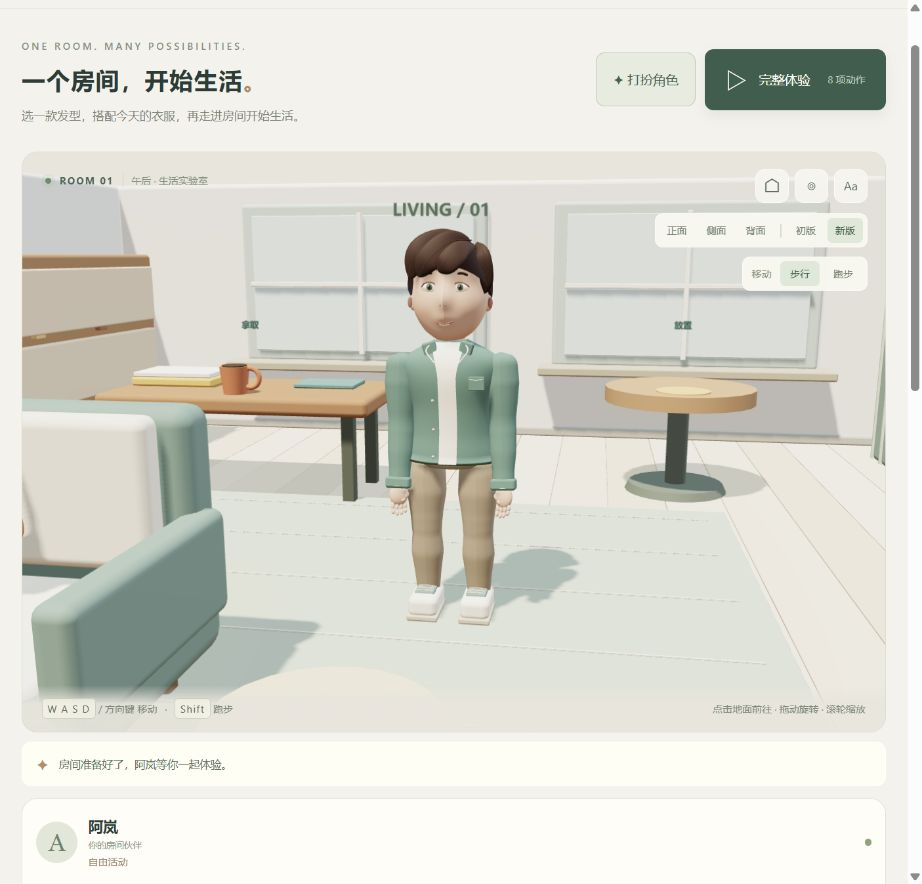
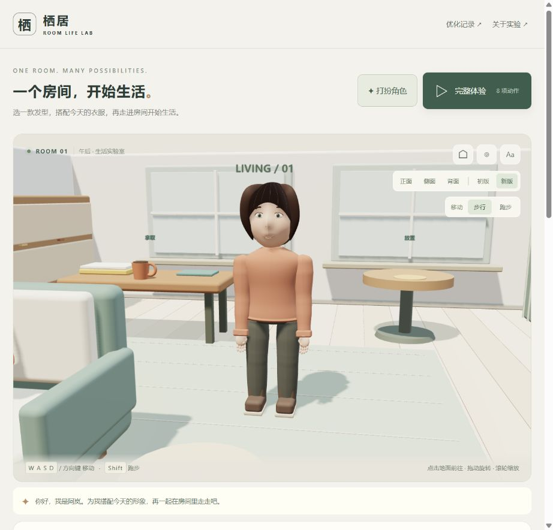
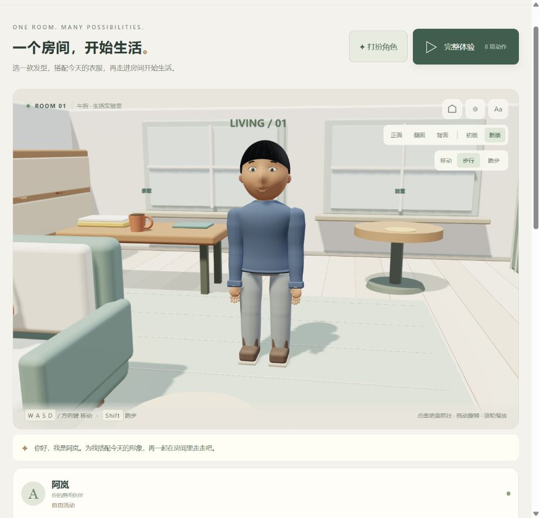
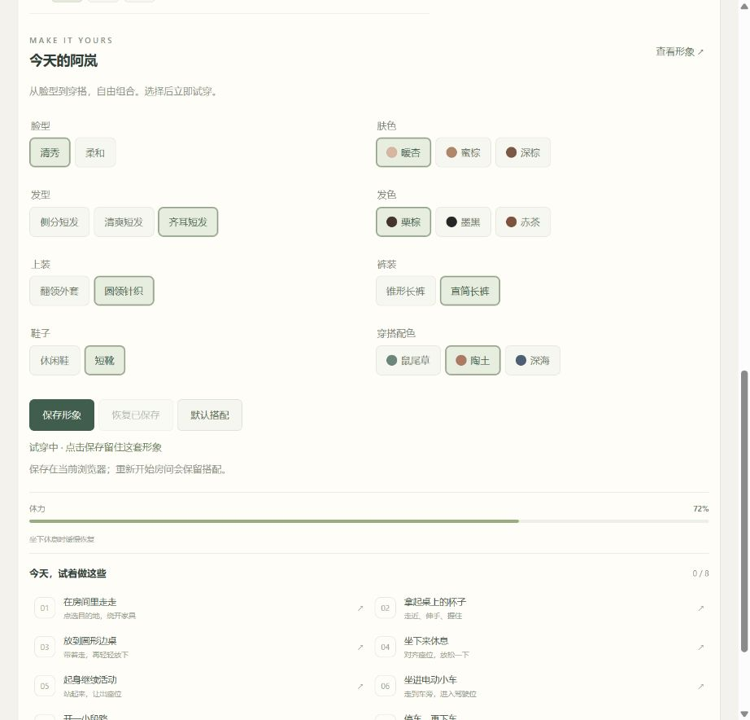
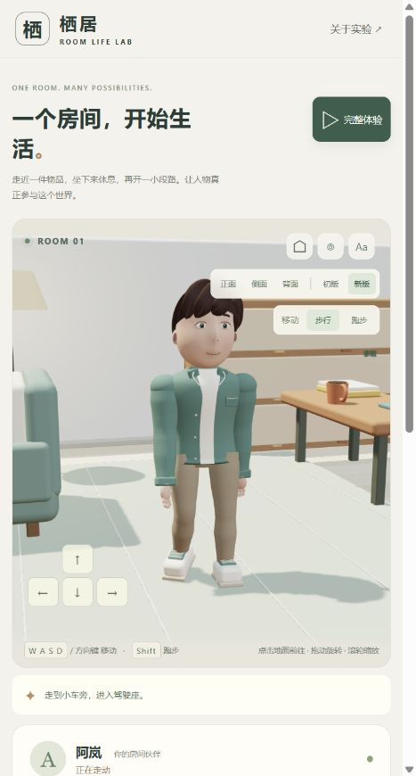
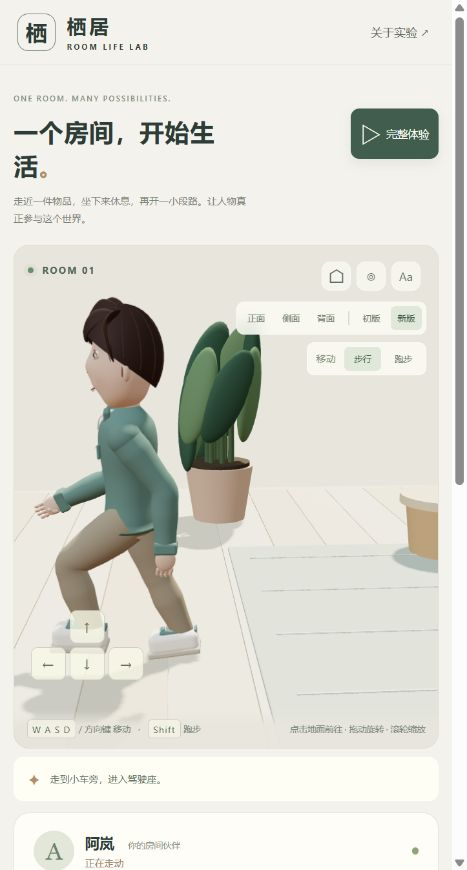

# 人物与动作优化记录

记录日期：2026-09-07。对象：005 房间生活实验的 V2 工作区。

本文汇总已经实施的优化；O01–O13 是记录编号，不是发布版本或 Git 标签。各轮历史状态按记录时间保留；本次源码、构建和文档随仓库提交发布，详见 [交付与遗留说明](handoff.md)。初版 V1 的完整演示、源码与截图继续冻结保存。

[项目入口](README.md) · [原库能力与关系](upstream-capabilities.md) · [交付与遗留说明](handoff.md) · [详细实验记录](notes.md) · [起步下跪专项排查](motion-audit.md) · [V1 留档说明](snapshots/README.md)

## 历轮优化索引

| 记录 | 原来的问题 | 已实施的修改 | 证据与边界 |
| --- | --- | --- | --- |
| O01 · 形象与留档 | 需要保存原始形象，并提升人物细节 | 冻结 V1；V2 调整脸型、头发、身体比例、衣物蒙皮、五指与简单神态；增加正侧背观察 | [形象及历史记录](notes.md)、[冻结文件](snapshots/README.md)；仍是风格化原创模型 |
| O02 · 固定半蹲 | 行走和跑步持续压低骨盆 | 移除固定下压，按双腿可达范围决定骨盆高度，补齐落脚周期边界 | [历史验证](notes.md)；这一轮改善不等于后续所有起步和步态问题均已解决 |
| O03 · 走跑手臂 | 步行与跑步共用小幅摆臂 | 手脚反向协调、跑步屈肘、持杯手稳定；增加走跑选择 | [摆臂实机图](../../docs/assets/projects/005-room-life/running-arms-v2.jpg)；该图的腿部仍是当时旧周期 |
| O04 · 独立跑步 | 跑步看起来像快走 | 分离跑步周期，加入腾空、后腿折叠回收、抬跟蹬地与重心曲线 | [跑步周期图](../../docs/assets/projects/005-room-life/running-cycle-v2-a.jpg)、[实现](src/running-gait.js)；非真实动力学求解 |
| O05 · 步行前后摆臂 | 手臂偏向身前，像端着手 | 调整上臂摆动中心、减小步行屈肘角度、手掌朝内 | [侧面图](../../docs/assets/projects/005-room-life/walking-arm-swing-v2.jpg)；手臂仍无通用避障 |
| O06 · 起步下跪 | 首步跨大步、短停反向后深蹲 | 清除过期落点、首步过渡、渐进加速、不可达脚位保护；修复顶墙运动状态与实际地面高度 | [专项排查及数值](motion-audit.md)；20 fps 复现曾降到约 0.508 m 骨盆局部高度 |
| O07 · 伸屈周期 | 稳定走路仍有双膝持续弯曲感 | 明确支撑伸展、屈膝回收、落地伸展；脚跟和前掌滚动接触 | [侧面图](../../docs/assets/projects/005-room-life/walking-extension-v2.jpg)；当轮同场景支撑中期平均屈膝约 19.8° → 9.4°，详见 notes |
| O08 · 收步与转向 | 双脚同时滑回站姿，转弯反复重启步态 | 逐脚抬起收步、固定另一只脚；限制旋转速度并保留周期；提示移出画面，构建增加资源内容版本 | [收步后实机图](../../docs/assets/projects/005-room-life/stopping-footwork-v2.jpg)、[收步实现](src/rest-footwork.js)；急转仍保留脚位纠正 |
| O09 · 减速到达 | 松键、走跑切换和到达时速度突变 | 有限距离减速、整条路径末段预判、低速缩步和减小摆臂；停止任务仍立即响应 | [详细参数及验证](notes.md)；无遮挡步行/跑步松键前移约 0.15/0.52 m，非完整惯性物理 |
| O10 · 身体配合 | 已有腿部和摆臂节奏，但加减速、转弯时躯干响应不足 | 增加前后倾斜、弯内侧倾、肩胯转动差、头部补偿和持杯减幅；动作后复位 | 下文详述；当前 **32 项测试通过** |
| O11 · 网页记录入口 | 优化记录仅在项目文件中，演示网页不便查看 | 增加网页入口、可展开历史卡片、目录、文档与证据链接，并随构建同步 | 下文详述；人物动作未改变 |
| O12 · 人物形象与衣橱 | 产品主线需要先建立可定制的人物，而不只是继续调整动作 | 调整默认脸部、连续肩袖与腰部；新增发型、衣物部件、脸型和配色选择，支持保存与恢复 | 下文详述；有限原创部件，未实现自由捏脸与通用换装 |
| **O13 · 写实目标与路线整理（本轮）** | 现有形象达不到用户的摄影级真人预期 | 整理阶段优化、形象设计方法、制作路线与验收标准，并同步到网页 | 文档与计划更新；未制作照片级模型或修改人物运行 |

## O13 · 写实目标与路线整理

目标升级为接近真人摄影观感、可换装且可参与房间生活的实时数字人。当前人物继续作为功能原型保留，暂停扩充其卡通外观部件。

- [后续优化清单与产品路线](product-plan.md)：列出阶段交付、前置条件、动作待办、性能与存档风险。
- [人物形象设计方案](character-design.md)：整理人设、三种候选美术方向、多视角参考、原创制作流程、工具与运行方案，以及头肩样板验收。
- 首个建议交付为一名角色的设计包和实时头肩样板，外观认可后再扩展全身、衣物及房间动作。
- 本轮为研究整理，没有生成参考图、制作写实人物或迁移引擎。文档中的计划不代表已有能力。

## O12 · 人物形象与衣橱

本轮将角色形象与定制提升为产品主线：先做可选择、可保存的角色，再进入房间生活。所有新部件继续由本项目制作，没有导入第三方人物、衣服或发型。

| 部分 | 已完成 | 使用方式 |
| --- | --- | --- |
| 默认人物 | 收窄下颌、微调耳部和眼白；头发改用受光材质；肩袖改连续曲面；收窄裤腰连接，减少静止时穿出衣摆 | 默认清秀脸型、侧分短发和绿色翻领外套 |
| 发型 | 侧分短发、清爽短发、齐耳短发；栗棕、墨黑、赤茶发色 | 发型与发色分别切换 |
| 面部 | 清秀、柔和两种有限轮廓预设；暖杏、蜜棕、深棕肤色 | 五官与头发跟随脸型缩放，面部与四肢肤色同步 |
| 上装 | 翻领外套、圆领针织；针织替换外套前襟、领片和口袋，增加圆领和连续衣摆收边 | 共用骨架和袖部，保持动作连续 |
| 裤装与鞋 | 锥形长裤、直筒长裤；休闲鞋、短靴 | 裤装轮廓与鞋面独立切换，鞋底接触高度保持 |
| 穿搭配色 | 鼠尾草、陶土、深海三组协调配色 | 同步上装、裤装和鞋子饰片；短靴鞋面保留棕色 |
| 保存与恢复 | 试穿、保存形象、恢复已保存、默认搭配 | 保存在当前浏览器，刷新恢复；默认搭配须点击保存才覆盖之前的搭配 |

页面顶部点击「打扮角色」进入衣橱，点击「查看形象」回到人物近景。正、侧、背观察与房间操作继续保留。初版 V1 下衣橱禁用，切回 V2 恢复当前搭配；重新开始房间不清除形象。

### 验证与边界

- 35 项测试通过。新增六组搭配覆盖所有部件选项的完整生活流程，60 次持物中换装不改变骨架、物品或动作状态，且不新增模型资源；保存、无存储、损坏内容、未知版本与写入失败均有检查。
- 背面实机复查发现清爽短发顶部有细小头皮缺口，已扩大覆盖并复查。后脑检查扩展为三种发型 × 两种脸型 × 七个高度，且只计入实际可见的部件，避免隐藏发型干扰验收。
- 真实浏览器验证了换发型、服装和配色、保存后刷新恢复、默认搭配与恢复已保存；自定义搭配切到跑步后完整体验达到 8 / 8，杯子归边桌、座位与车辆占用释放。
- 这是有限部件的原创衣橱首版。两种脸型基于同一套五官与头部轮廓变化；尚无自由捏脸、身高体型编辑、服装上传、多套命名存档或跨设备同步。
- 衣物没有真实布料模拟，发型也没有逐发丝或动态系统；极端姿态的穿插、肘膝变形、五指接触及手机性能仍需继续验收。通过功能测试不等于精细人物品质已经完成。

实现见 [形象配置与存储](src/appearance.js)、[人物与部件](src/character.js)、[换装检查](tests/appearance.test.mjs)。[改造前截图](../../docs/assets/projects/005-room-life/before-wardrobe-v2.jpg) 与 [改造前人物源码](snapshots/v2-before-wardrobe/character.js) 保留用于对照；V1 完整留档继续冻结。

## O11 · 网页记录入口

优化记录现已接入演示网页。页面顶部点击「优化记录」会在新标签页打开，保留当前房间状态。

- 历史优化按最新优先显示为可展开卡片，本轮内容、验证和后续方向可通过目录跳转。
- 页面由本文及链接文档在构建时生成，避免同时手工维护网页和 Markdown。
- 详细实验记录、专项排查、项目说明和留档说明生成本地网页；引用的截图与源码证据映射为可访问链接。
- 构建检查本地链接和锚点是否存在。记录页使用独立样式及内容版本，支持窄窗口阅读；表格可横向滚动。
- 本轮只改进记录的访问和维护，没有改变人物动作；人物动作测试基线仍为 32 项。

## 下一步优先优化

最新优先级以照片级写实目标为准：

1. 确定人物身份、美术方向和统一多视角参考。
2. 验证制作流程与运行环境，完成可旋转、眨眼、转头的实时头肩样板。
3. 完成全身与第一套服装，再验证房间内走路、坐起和拿杯子。
4. 适配换装、完整八项动作、性能及存档。
5. 扩展养成、内容和自然语言交互。

详见 [阶段优化清单](product-plan.md) 与 [形象设计方法](character-design.md)。这些均为后续工作；不能用单张概念图或当前功能测试替代照片级三维人物验收。

## O10 · 身体配合详细记录

此前胸部已有跟随摆臂的小幅转动、跑步已有固定前倾，但没有根据速度变化和转向速度产生相应的躯干反应。此次新增 [body-motion.js](src/body-motion.js)，将这些小幅姿态变化叠加到现有动作上。

| 优化项 | 修改内容 | 预期可见效果 |
| --- | --- | --- |
| 加速身体反应 | 根据速度增加量加入小幅前倾及骨盆前移 | 起步时上身参与发力，不只是脚动起来 |
| 制动身体反应 | 减速时产生短暂的后向姿态偏移，随后平滑回正 | 身体从前进状态逐渐稳定下来 |
| 转弯侧倾 | 根据速度与转向速度调整躯干侧倾、骨盆横向偏移 | 转弯时身体向弯内侧倾斜，减小直立旋转的机械感 |
| 肩胯协调 | 胯部小幅滞后，肩部向转向方向增加转角 | 上身和下身不再完全同步拧转 |
| 头部配合 | 视线随转向小幅偏移，头部反向补偿部分躯干侧倾 | 头部有转向响应，又不会完全跟着身体歪斜 |
| 持杯适配 | 身体附加反应减至空手时的 45%，抓握约束继续优先 | 持物运动相对克制，杯子保持直立并贴合手腕 |
| 复位与动作优先级 | 停止后附加反应消退；重置清空历史速度，拿放、坐起和驾驶交由各自动作姿态接管 | 不把上一段转弯或制动的倾斜残留到下一动作 |

### 幅度控制

以下是当前制作参数上限，不是实测人体指标；平滑处理后的实际幅度取决于操作过程。

- 额外前倾不超过约 3.7°，额外后向偏移不超过约 4.9°；跑步自身的前倾另有原有曲线。
- 躯干额外侧倾不超过约 6.3°，骨盆横向偏移不超过 1.6 cm。
- 骨盆前后偏移约束在后移 1.1 cm 至前移 0.9 cm 内，避免重新引入大幅屈膝或失去接地。
- 输入突变先限幅再平滑；左右转向采用对应的相反方向。

这是程序化的视觉姿态调整，**没有模拟真实质量、重心平衡、鞋底摩擦或肌肉力量**。

### 验证结果

- **32 项自动化测试通过**，静态构建及仓库项目校验通过。
- 新增 [身体配合测试](tests/body-motion.test.mjs)：20 / 30 / 60 fps 下验证加减速反应的方向、范围、连续性和复位；验证左右转弯的侧倾及肩胯差异；验证持杯减幅、杯把贴合和交互姿态优先。
- 原有防下跪、支撑腿伸展、跑步腾空、摆臂、脚部接触、减速收步、生活任务及 V1 留档完整性检查继续通过。
- 浏览器已检查转向、跑步和切回步行的姿态，保存以下真实截图。截图用于外观记录，不能单独证明完整动作连续性。
- 确认页面加载本轮脚本内容版本 `34b129a8b3ca` 后，完整体验切到跑步并完成 **8 / 8**；杯子归边桌、座位和车辆占用释放，浏览器 error / warn 为空。该内容版本用于识别本轮构建，不是 Git 提交号。

### 本轮未解决的问题

| 问题 | 当前状态 |
| --- | --- |
| 急转脚底微滑 | 极端输入仍可能触发脚位纠正，未建立完整的物理支撑与转身动画 |
| 坐起、上下车接触 | 仍是预设过渡，没有全身通用环境碰撞求解 |
| 肩部形体与衣服变形 | 本轮调整骨骼姿态，没有重做肩颈造型、蒙皮或布料 |
| 通用抓握 | 继续适配当前杯子和方向盘，没有逐指接触或任意物品抓握 |
| 精细角色品质 | 头发动态、面部表情、衣物物理和手机性能验收仍需后续工作 |

## 后续记录约定

每轮保留「原问题 → 修改 → 验证 → 局限」四项。历史截图和测量标明当时状态，不把旧截图当作最新效果，不把测试数量当作自然度评级。若后续再次暴露同类问题，应记录遗漏场景并补充验证，而不是覆盖旧结论。
