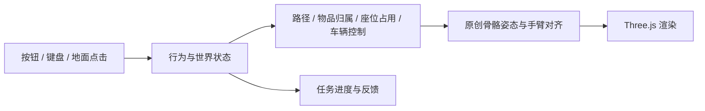

# 005 · 栖居 · 原创人物生活交互实验室

自行制作一个人物和一个房间，验证走动、拿取、搬运、放置、坐起和驾驶的连续行为。当前交付为可操作的浏览器原型。

[返回总索引](../../README.md) · [演示页面](../../docs/demos/005-room-life/index.html) · [研究与验证](notes.md) · [产品化路线](product-plan.md)

## 项目档案

| 项目 | 内容 |
| --- | --- |
| 类型 | 本仓库原创子项目，编号 005 永久保留 |
| 源码仓库 | https://github.com/yydshly/0906_codex_project |
| 研究日期 / 版本 | 2026-09-06，首版工作区；基于本仓库提交 `22376ecd033a00404d9ed311437759d8fd059f46`，本次新增内容尚未提交 |
| 讨论参考 | https://github.com/RareSense/Nova3D；仅为最初问题来源，未复用其代码或服务 |
| 参考研究版本 | Nova3D `2299e02d57e513966afaa8cfcc510e8c01110dd7`，不属于本项目运行依赖 |
| 依赖 | Three.js `0.180.0`，MIT；构建工具 esbuild `0.25.10`，MIT |
| 自有内容许可证 | 本仓库尚未声明独立开源许可证；第三方 MIT 不自动成为原创内容许可证 |
| 状态 | 研究中：限定场景的功能原型，人物和动作精致度待迭代 |
| 部署 | 静态页面，无后端、无 API 密钥、无运行时模型下载 |

## 真实画面


人物、家具、杯子、小车均由本项目代码建立；左侧为生活区，右侧为有限范围驾驶区。


人物采用自建骨骼和蒙皮几何；衣领、口袋、头发、面部和鞋子也是原创几何。图片为实际浏览器截图。


## 当前能力

| 能力 | 实现 | 边界 |
| --- | --- | --- |
| 行走、跑步 | 点击地面寻路；WASD / 方向键移动，Shift 跑步，避开家具 | 单角色、平地、固定布局 |
| 拿取、持物 | 接近杯子、手臂对齐把手；交接后杯子跟随手部，持物可移动 | 一个预设杯子，手掌和拇指简化 |
| 放置 | 搬运到圆形边桌，交接时释放手部归属；支持再次拿取 | 预设放置位置 |
| 坐下、起身 | 对齐座位、落座、休息恢复体力、起身释放占用 | 一张匹配当前角色比例的椅子 |
| 上车、驾驶、下车 | 控制权切到小车；前进、倒车、转向、边界停车；下车前减速 | 简化平面车辆模型；短程体验走直线，上下车为简化过渡 |
| 连续体验 | 一键串联八项动作；也可单独重复操作、停止、重置 | 固定任务序列，未接入大模型 |

## 本地运行

已使用 Windows、Node.js `v22.15.0`、Python `3.10.11` 运行。从仓库根目录执行：

```powershell
cd projects/005-room-life
npm ci
npm test
npm run build
cd ../..
python -m http.server 8766 --bind 127.0.0.1 --directory docs
```

打开 http://127.0.0.1:8766/demos/005-room-life/ 。构建产物已保存到静态发布目录；只体验时可直接启动静态服务器。模块脚本不能直接以 `file://` 打开。

需要支持 WebGL 的浏览器。点击「完整体验」串联八项动作；「◎」切换人物近景，「⌂」回到全景。拖动旋转、滚轮缩放；小屏幕提供触控方向键。页面隐藏时暂停推进。构建后运行不需要资产 CDN。

## 实现分工



- [simulation.js](src/simulation.js)：纯逻辑世界、网格寻路、前置条件、归属、占用和驾驶。取消动作时维持一致状态。
- [character.js](src/character.js)：原创几何、16 根骨骼、四肢蒙皮、程序化步态、眨眼和手臂 CCD 对齐；手部实际位置驱动杯子。
- [view.js](src/view.js)：房间、车辆、光照、镜头和显示。
- [main.js](src/main.js)：输入、循环、任务反馈、换配色和窗口适配。
- [tests/simulation.test.mjs](tests/simulation.test.mjs)：连续任务、归属、取消、寻路和车辆边界验证。
- [build.mjs](build.mjs)：打包到静态目录，保留第三方许可证。

## 验证与局限

六项自动化行为测试通过，真实浏览器中完整流程达到 `8 / 8`。详见 [notes.md](notes.md)。这个结果说明限定角色、物品和房间的行为闭环可运行，不代表通用人物生成或任意物品交互已经实现。

当前是风格化原型。走路仍有滑步风险；完整手指、关节极限、布料、头发动态、精细上下车动作尚未完成。没有多角色避让、存档、对话、关系养成或实时物理抓握；车辆没有悬挂、轮胎摩擦或碰撞冲量。未做手机实机帧率和低端设备性能验收。

## 来源与许可证

人物、房间、车辆、物品和程序化动作由本项目编写，没有使用下载的人物、贴图、动作包或动作捕捉片段。Three.js 是通用图形依赖，保留 [MIT 许可证](../../docs/demos/005-room-life/assets/three-LICENSE.txt)。Nova3D 是讨论参考，不是本项目上游代码。
