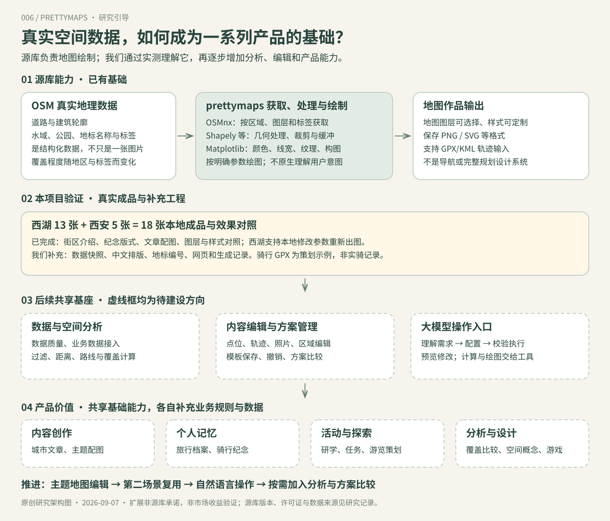
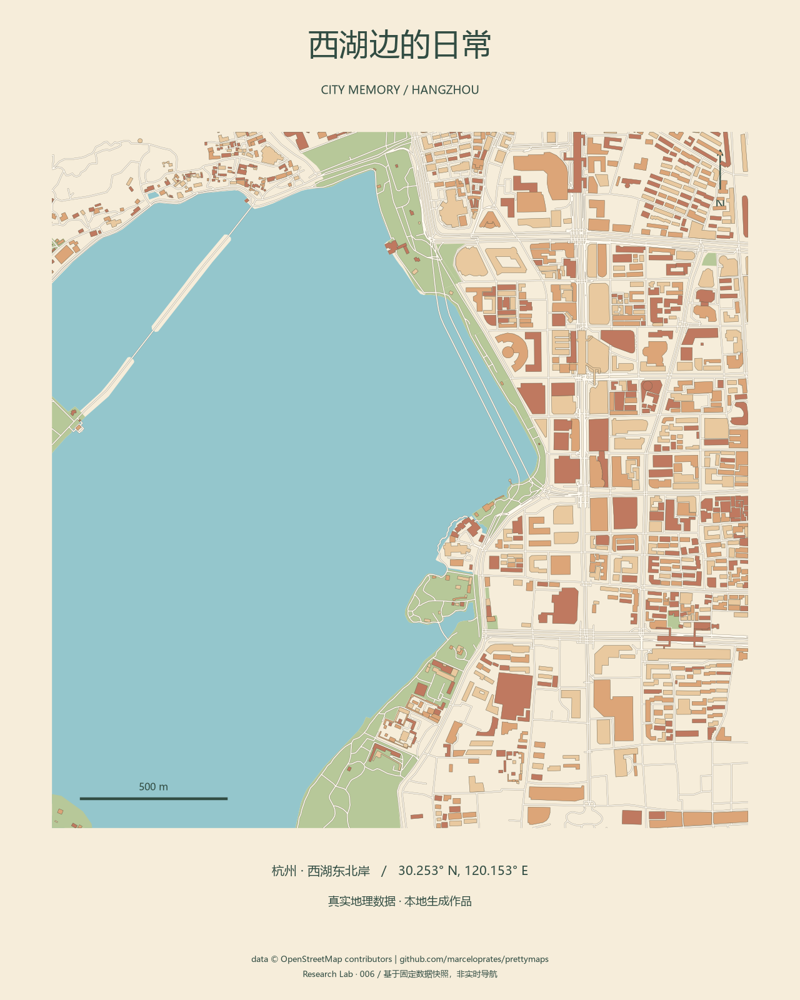

# 006 · Prettymaps · 真实场景使用实验

> 在西安城内与杭州西湖实际运行 prettymaps，展示街区介绍、旅行及骑行纪念版式、网站文章配图。西湖实验支持修改标题、配色和图层后本地重新生成。

[返回总索引](../../README.md) · [展示页面](../../docs/demos/006-prettymaps/index.html) · [研究过程](notes.md) · [上游仓库](https://github.com/marceloprates/prettymaps)

## 一图理解源库与后续价值



[研究总览：原理、大模型角色与产品扩展](research-summary.md)

## 阅读入口

- [陕西场景展示：五张实际成品](../../docs/demos/006-prettymaps/shaanxi.html) · [场景分析、用途与复现](shaanxi-scenarios.md)：西安街区介绍、旅行纪念、策划 GPX 骑行版式、文章与网站配图。

- [完整能力清单与效果证据](capabilities.md)：六个维度，逐项区分本地实测、上游示例、源码核查与项目扩展。
- [对我们的意义与扩展路线](value-and-roadmap.md)：价值、优先级、工作量和验收方式。
- 展示页按「能力全貌 → 效果对照 → 场景体验 → 意义 → 扩展」组织。新增6张本地对照图，与原有7张场景图互补。

## 先看真实结果



| 使用场景 | 真实输入与操作 | 输出 |
| --- | --- | --- |
| 西湖纪念海报 | 真实湖岸数据，设置三种配色与中文标题 | [暖色](../../docs/assets/projects/006-prettymaps/generated/poster-warm.png)、[墨色](../../docs/assets/projects/006-prettymaps/generated/poster-ink.png)、[夜色](../../docs/assets/projects/006-prettymaps/generated/poster-night.png) |
| 湖岸地点导览 | 从 OSM 地物中选择六公园、三公园、一公园、涌金公园，附编号和名称 | [导览图](../../docs/assets/projects/006-prettymaps/generated/guide-warm.png) |
| 道路与建筑观察 | 同一范围保留道路/建筑，或只画其中一层 | [组合](../../docs/assets/projects/006-prettymaps/generated/structure-ink.png)、[道路](../../docs/assets/projects/006-prettymaps/generated/structure-ink-streets.png)、[建筑](../../docs/assets/projects/006-prettymaps/generated/structure-ink-building.png) |

本阶段 7 张场景作品均为本机实际运行生成，不是作者图片或前端滤镜。每张都有 PNG、SVG 和 JSON 生成记录。页面下方折叠区保留第一阶段的上游示例。

## 数据与实测

- 区域：杭州西湖东北岸，中心 `(30.253, 120.153)`，1200 米半范围的正方形，约 2.4 × 2.4 km。
- 抓取日期：2026-09-07。来源 OpenStreetMap contributors，经 VK Maps 公共 Overpass 镜像获取。
- 实际保存：913 个建筑要素、2506 条道路图边、7 个水域要素、19 个公园要素。道路图边不是独立道路条数，可能包含双向边。
- 首次成功获取并完成原生 `prettymaps.plot()`：22.36 秒。这不含安装时间和此前失败的服务连接尝试。
- 缓存后单张绘制约 3 秒，浏览器自定义“我的西湖旅行 / 深夜金色”实测 2.69 秒。
- GeoJSON 快照、坐标和清单在 [data](data/)；[完整生成记录](../../docs/assets/projects/006-prettymaps/generated/cases.json)。

这些数字仅描述当前 OSM 数据快照，不代表现实中全部地物。导览编号取裁剪后地物内部代表点，不是入口位置；没有路线规划和实时导航。

## 运行与体验

已有独立 Python 3.12.13 虚拟环境。仓库根目录运行：

```powershell
$env:PYTHONUTF8='1'
projects/006-prettymaps/.venv/Scripts/python.exe projects/006-prettymaps/server.py
```

打开 `http://127.0.0.1:8767/demos/006-prettymaps/`：

1. 选择海报、导览或道路建筑场景，查看对应实际成品。
2. 从“查看已生成的效果”切换配色或单图层成品。
3. 修改标题、风格、图层，点击“生成我的地图”。
4. 等待实际生成后放大查看、下载 PNG 或 SVG。

服务只监听本机 `127.0.0.1`，使用保存的真实数据快照。没有开放任意地点搜索。静态服务器和 GitHub Pages 可查看成品，但不提供实时生成；页面会标明“成品浏览模式”。如需发布生成后端，应单独部署并在登记表填写外部演示地址。

## 重建环境与数据

上游固定提交：`02f85870ced807b7d24ce1764764ff877f9edffd`，安装元数据版本为 1.4.2。已保存本次完整 [依赖清单](requirements-lock.txt)。

```powershell
$env:PYTHONUTF8='1'
uv venv --python 3.12 projects/006-prettymaps/.venv
uv pip install --python projects/006-prettymaps/.venv/Scripts/python.exe -r projects/006-prettymaps/requirements-lock.txt
# 已有 data 快照时，仅需重新出图：
projects/006-prettymaps/.venv/Scripts/python.exe projects/006-prettymaps/render_scene.py
# 确实需要更新地图数据时再执行：
projects/006-prettymaps/.venv/Scripts/python.exe projects/006-prettymaps/prepare_data.py
projects/006-prettymaps/.venv/Scripts/python.exe projects/006-prettymaps/prepare_places.py
projects/006-prettymaps/.venv/Scripts/python.exe projects/006-prettymaps/render_scene.py
```

中文字体使用 Windows 微软雅黑；其他系统需要安装中文字体并调整 render_scene.py 中字体设置。

## 哪些是库能力，哪些是本项目补充

| 部分 | 实现 |
| --- | --- |
| 首次地理范围、地物查询、几何处理、地图绘制 | 固定版本 prettymaps.plot()，调用 OSMnx / Shapely / Matplotlib |
| 后续离线出图 | 读取真实 GeoJSON，调用同版 prettymaps.draw.plot_gdf()，固定随机种子 |
| 标题、比例尺、指北箭头、导览编号排版 | 本项目通过 Matplotlib 补充 |
| 公园名称与位置 | 从实际返回的 OSM 图层提取，保存原始 OSM 对象链接 |
| 网页控件、API、下载与生成记录 | 本项目的静态页面和本地 Python 服务 |

几何没有手工虚构。换风格是重新设置图层样式并绘制，关图层是省略对应地物。导览示例没有调用上游 keypoints 自动标注接口，编号和排版属于本项目扩展。

## 已遇到的真实问题

1. Windows 中文默认编码导致上游构建读取 README 时失败，设置 `PYTHONUTF8=1` 后成功安装。
2. 默认 Overpass 实例连续返回 429；private.coffee 连接失败；VK Maps 的状态轮询也未能正常完成。
3. 对照 [OSM 公共实例清单](https://wiki.openstreetmap.org/wiki/Overpass_API#Public_Overpass_API_instances)，改用 VK Maps interpreter 的有超时限制 GET 请求。`prepare_data.py` 中局部替换 OSMnx 请求函数，只适配传输与缓存；OSMnx 仍解析真实响应，prettymaps 仍执行完整绘图流程。
4. 上游 requirements 依赖较多（含可视化和笔记本工具）；本次使用独立环境，未改系统 Python。

## 来源、许可与边界

- 上游代码作者 Marcelo Prates；[LICENSE 副本](UPSTREAM-LICENSE)为 AGPL-3.0。setup.py 的 MIT 字段与根许可不一致，正式复用应澄清。
- 地图数据 © OpenStreetMap contributors，数据遵循 ODbL：[版权与署名](https://www.openstreetmap.org/copyright)。保存快照中只保留本次研究需要的几何及少量属性。
- 所有本地输出保留 OSM 和 prettymaps 署名。
- [图片来源清单](../../docs/assets/projects/006-prettymaps/SOURCES.md)区分作者示例与本项目生成结果。
- 陕西阶段已实测策划 GPX 的读取与绘制；用户真实 GPX、KML、高程阴影、任意地点在线输入、导航服务仍未测试。骑行版式没有冒充实际骑行记录。
