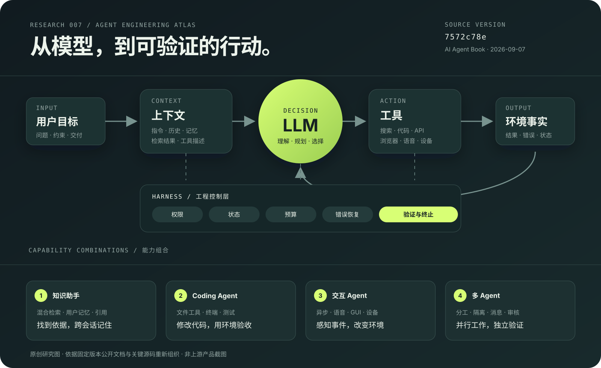
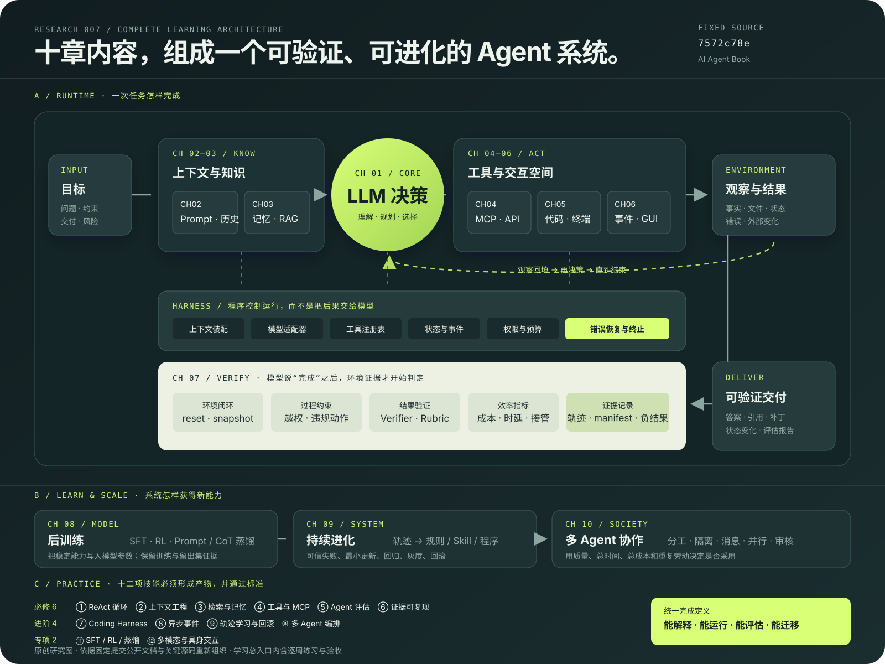

# 007 · AI Agent Book：Agent 工程能力图谱

> 用一套可阅读、可运行、可核验的实验体系，解释大模型怎样获得上下文、调用工具、完成任务，并从结果中继续改进。

[返回总索引](../../README.md) · [Web 学习总入口](https://yydshly.github.io/0906_codex_project/demos/007-ai-agent-book/) · [学习指南留档](learning-guide.md) · [源码证据](sources.md) · [研究记录](notes.md) · [上游仓库](https://github.com/bojieli/ai-agent-book)

## 项目档案

| 项目 | 内容 |
| --- | --- |
| 上游 | [bojieli/ai-agent-book](https://github.com/bojieli/ai-agent-book) |
| 研究版本 | [`7572c78e8284416d05cd3435c627b1b38c452ff2`](https://github.com/bojieli/ai-agent-book/tree/7572c78e8284416d05cd3435c627b1b38c452ff2) |
| 核对日期 | 2026-09-07 |
| 上游形态 | 10 章开源书稿、109 个配套实验、PDF / EPUB / 在线站点及 15 种语言入口 |
| 运行要求 | 上游统一支持 Python 3.11–3.13；不同实验还可能需要模型凭据、浏览器、CUDA、FFmpeg、Ollama、模拟器或外部仓库 |
| 上游许可 | [Apache License 2.0](https://github.com/bojieli/ai-agent-book/blob/7572c78e8284416d05cd3435c627b1b38c452ff2/LICENSE) |
| 本轮范围 | 阅读固定版本正文索引、章节说明、核心循环源码和实验状态；制作原创能力图与静态交互展览 |
| 验证边界 | 未安装上游全部依赖，未调用模型 API，未重跑 109 个实验；实验数值均按上游证据边界转述 |
| 当前状态 | 能力、原理、场景、扩展与采用建议整理完成；实际引入仍需针对本研究库做小规模对照实验 |

## 一句话价值

这不是一个安装后直接提供全部能力的 Agent 产品，而是一个 **Agent 工程教材、参考实现和实验档案**。它最有价值的地方，是把“模型会回答”拆成可以观察、替换和验证的系统组件，并保留成功、失败和未完成实验的证据边界。

## 先看能力图

[](https://yydshly.github.io/0906_codex_project/demos/007-ai-agent-book/)

图中关系依据上游书稿和实现重新组织，属于本项目原创研究图，不是上游产品截图。点击图片进入交互展览，可按任务选择能力组合，并逐步观察 Agent 循环。

## 全书架构与练习地图

[](https://yydshly.github.io/0906_codex_project/demos/007-ai-agent-book/#architecture)

这张图把十章放入同一个系统：第 1 章是决策循环，第 2–3 章提供上下文与知识，第 4–6 章提供工具与交互，第 7 章负责环境和证据验证，第 8–9 章更新模型或系统能力，第 10 章扩展到多个 Agent。图的下方把 6 项必修、4 项进阶和 2 项专项练习映射回架构层；具体练习、产物和通过标准在 Web 总入口继续展开。

## 它提供什么能力

上游以“Agent = LLM + 上下文 + 工具”为主线，用十章逐步扩展 Agent 的观察、行动、评估和学习能力。

| 能力层 | 对应内容 | 解决的问题 | 代表实验或实现 |
| --- | --- | --- | --- |
| 基础循环 | 目标理解、模型决策、工具结果回填、多轮终止 | 如何从一次回答变成多步执行 | Web Search Agent、Coding Agent |
| 上下文工程 | Prompt、KV Cache、Skills、压缩 | 怎样把此刻真正需要的信息交给模型 | `kv-cache`、`prompt-engineering`、`context-compression` |
| 记忆与知识 | 用户记忆、稠密 / 稀疏检索、RAG、结构化索引 | 怎样找到外部事实并跨会话保留经验 | `user-memory`、`retrieval-pipeline`、`agentic-rag` |
| 工具与协议 | MCP、感知工具、执行工具、协作工具、主动发现 | 怎样把模型意图变成真实操作 | `execution-tools`、`active-tool-discovery` |
| 通用执行 | 代码读写、终端、浏览器、表单、SQL、媒体制作 | 怎样交付文件、代码、查询和界面变更 | `coding-agent`、`erp-agent`、`paper-to-ppt` |
| 交互空间 | 异步事件、语音、Computer Use、机器人 | 怎样处理持续事件、不同模态和物理动作 | `async-agent`、Computer Use、语音与机器人实验 |
| 评估 | 环境重置、轨迹、Verifier、指标、统计比较 | 怎样判断任务真的完成、方案真的更好 | τ²-bench、SWE-bench、AndroidWorld、成本分析 |
| 后训练 | SFT、RL、蒸馏、工具调用内化 | 什么时候需要把能力写入模型参数 | `prompt-distillation`、`cot-distillation`、RL 复现轨道 |
| 持续进化 | 从失败轨迹提炼规则，验证、发布与回滚 | 怎样让系统根据真实经验改进 | `trajectory-verifier`、`self-modifying-agent` |
| 多 Agent | 任务分工、信息共享 / 隔离、并行、独立审核 | 怎样让多个角色围绕同一目标协作 | `parallel-web-research`、`multi-role-transfer` |

这些能力分布在独立实验中。README 的“可独立运行”表示代码和入口存在，并不代表所有凭据、硬件、外部服务和正式验收在任意环境都已满足。

## 值得学习和练习的技能

| 层级 | 技能 | 建议练习 | 学会的判断 |
| --- | --- | --- | --- |
| 必修 | ReAct 与工具调用循环 | 实现一个最多 5 轮的搜索 Agent | 能解释每次工具调用和终止原因 |
| 必修 | 上下文工程 | 比较完整、摘要、关键信息三种上下文 | 同时报告质量、token 与缓存影响 |
| 必修 | 混合检索与记忆 | 组合 BM25、向量、RRF 和 Reranker | 用固定问答集测召回与引用准确率 |
| 必修 | 工具设计与 MCP | 制作只读仓库工具，覆盖错误和越权路径 | 模型无法绕过程序权限 |
| 必修 | Agent 评估 | 建立 20–30 个带标准答案的任务 | 结果可复现，失败可归因 |
| 必修 | 证据工程 | 保存版本、输入、轨迹、结果和 manifest | 干净环境能复查结论 |
| 进阶 | Coding Harness | 完成一次读、改、测、修复循环 | 交付含可审阅 diff 和回归结果 |
| 进阶 | 异步与事件驱动 | 在长任务中处理中断、取消和恢复 | 状态一致，无丢失事件或悬挂进程 |
| 进阶 | 轨迹学习与回滚 | 从重复失败提炼最小规则并回归 | 边界集、保留集和安全集通过 |
| 进阶 | 多 Agent 编排 | 比较单 Agent 与多 Agent 处理同一任务 | 能量化质量、总时长、成本和协调开销 |
| 专项 | SFT、RL 与蒸馏 | 复现小规模蒸馏前后对照 | 数据切分、checkpoint 和留出结果完整 |
| 专项 | 多模态与具身交互 | 从只读 GUI 任务记录动作轨迹 | 截图、动作、答案和安全边界对应 |

完整的章节顺序、每周练习、阶段产物、通过标准、进度记录和首个实战已经接入 [Web 学习总入口](https://yydshly.github.io/0906_codex_project/demos/007-ai-agent-book/)。[learning-guide.md](learning-guide.md) 作为可下载的研究留档。

## 推荐学习顺序

1. **第 1–2 章：建立地图。** 理解最小 Agent、Harness 和上下文。
2. **第 3–5 章：完成闭环。** 接入知识、工具和代码执行。
3. **第 6–7 章：扩展并验证。** 学习异步、多模态和评估方法。
4. **第 8–9 章：安全更新能力。** 理解训练、轨迹学习、回归和回滚。
5. **第 10 章：组织多个 Agent。** 最后研究分工、隔离、并行与审核。

每个实验都应回答八个问题：验证什么假设、改变什么变量、使用什么输入、各组件怎样工作、证据保存在哪里、结果是否显著、结论边界是什么、怎样迁移到自己的任务。

## 底层原理

Agent 的最小工作循环是：

1. **组织上下文**：把用户目标、系统规则、历史、检索结果和可用工具描述组成模型输入。
2. **模型选择下一步**：模型生成回答，或输出结构化工具名称与参数。
3. **程序执行工具**：Harness 查找对应实现，在真实环境中搜索、读写、计算或操作界面。
4. **观察回填**：工具输出被加入消息历史，模型根据新事实继续判断。
5. **终止与验证**：模型给出最终结果；环境或独立验证器检查过程约束和任务结果。
6. **经验更新**：可信轨迹可以更新记忆、规则、程序或模型参数，并经过回归和回滚门禁。

这里的关键工程分工是：**模型提出动作，程序执行动作，环境提供事实，验证器判定结果。** Coding Agent 源码展示了工具调用解析、注册表查找、执行、错误包装和结果回填；搜索 Agent 展示了带最大迭代次数的 ReAct 循环；检索流水线展示了稠密与稀疏结果合并、RRF 融合和神经重排序。对应证据见 [sources.md](sources.md)。

## 使用场景

| 场景 | 需要的能力组合 | 典型交付 | 主要风险 |
| --- | --- | --- | --- |
| 开源项目研究助手 | 搜索 + 仓库读取 + 代码执行 + 引用核验 | 有版本锚点的研究报告 | 来源过时、结论超出证据 |
| 专业知识助手 | 文档处理 + 混合检索 + 用户记忆 + 引用 | 可追溯问答与主动提醒 | 召回遗漏、权限和错误记忆 |
| Coding Agent | 工作区工具 + 测试 + 沙箱 + Reviewer | 补丁、验证记录和失败解释 | 越权修改、假成功、回归 |
| 业务操作助手 | MCP / API + 表单 + 数据库 + 人工确认 | 查询、登记或流程结果 | 误操作、权限和幂等性 |
| 内容生产流水线 | 文档理解 + 图像 / 语音工具 + 多角色审核 | 演示稿、讲解和视频 | 素材来源与质量漂移 |
| 多 Agent 研究 | 任务拆分 + 上下文隔离 + 消息总线 + 验收 | 并行证据和综合结论 | 重复工作、协调成本和错误扩散 |

简单问答通常不需要完整 Agent 架构。只有任务包含多步决策、外部事实、实际操作或可验证交付时，增加工具与控制循环才更有意义。

## 实验带来的工程判断

上游最值得重视的并非功能数量，而是它没有把预期写成既定事实：

- 主动工具发现实验两组任务均完成，没有观察到准确率提升，但减少了暴露的工具描述和运行时间。
- 代码辅助逻辑推理实验中，代码路线低于纯思考路线，说明“能调用代码”不自动等于“推理更正确”。
- Agent 创建实验中，模板路线效率更高，但没有同时获得严格的质量和效率优势。
- 多项训练和持续学习实验保留未显著、退化或只在部分指标改善的结果。
- 日历、邮箱、真实通知和部分机器人实验仍受授权、外部服务或硬件约束，状态台账没有用模拟结果代替正式验收。

因此，采用 Agent 技术时应比较 **完成率、过程违规、证据质量、成本、时延、人工接管和回归**，而不是只记录“模型成功返回了内容”。

## 对我们的意义

| 我们的对象 | 可以直接借鉴 | 应先验证的问题 |
| --- | --- | --- |
| 001 专家知识组织 | 混合检索、结构化记忆、引用和检索评估 | 文件检索、混合 RAG、多轮 Agentic RAG 哪种更适合现有资料？ |
| 004 Multica | 上下文隔离、并行研究、独立验证、轨迹证据 | 多 Agent 是否提升交付质量或节省总时间？协调成本是多少？ |
| 005 栖居 | 长期记忆、事件驱动、语音和角色状态 | 记忆怎样影响角色行为，哪些动作必须由规则约束？ |
| 研究库整体 | 固定版本、实验台账、负结果、可执行验收 | 每项研究能否在干净环境被复查，结论是否超出证据？ |

我们不需要移植整套上游代码。更实际的价值是吸收三项方法：

1. 给每个研究结论绑定上游版本、直接证据和验证边界。
2. 把“能运行”与“实验成立”分开记录，保留负结果和阻塞项。
3. 为研究助手建立小型评估集，在引入 RAG、多 Agent 或自动改进前后做对照。

## 可扩展方向

基于上游架构，可以增加模型适配器、MCP 工具、Skills、评测环境和多模态设备；组合检索、记忆、评估和持续进化形成领域 Agent；为执行增加权限、预算、幂等性和人工确认；从运行轨迹建立失败分类、回归集与可回滚更新。

面向本研究库，建议先建立“研究任务基准”，统一保存输入、工具轨迹、引用、输出、人工评分、耗时与成本，再比较文件检索 / 混合 RAG / Agentic RAG，以及单 Agent / 多 Agent。只有在重复任务和稳定评估集形成后，再考虑自动优化 Prompt、Skill 或模型参数。

建议的第一个实验是用 001 项目的资料准备 20–30 个问题，在相同模型下比较三种检索方案。先验证答案正确率和引用准确率，再决定是否引入复杂的 Agentic RAG。

## 本地查看

本项目只新增研究文档、原创 SVG 和静态交互页，不需要上游依赖：

```sh
python -m http.server 8000 --directory docs
```

浏览器访问 `http://localhost:8000/demos/007-ai-agent-book/`。上游实验安装和凭据配置请以固定版本的各章 README 为准；不要把一次依赖安装或 smoke test 记作实验复现完成。

## 来源、许可与边界

详细依据和稳定链接见 [sources.md](sources.md)。本项目没有导入上游代码、书稿或配图；能力图、研究文档和交互页均为依据公开资料重新组织的原创表达。上游仓库采用 Apache License 2.0，外部复现项目仍分别遵循各自许可证。
