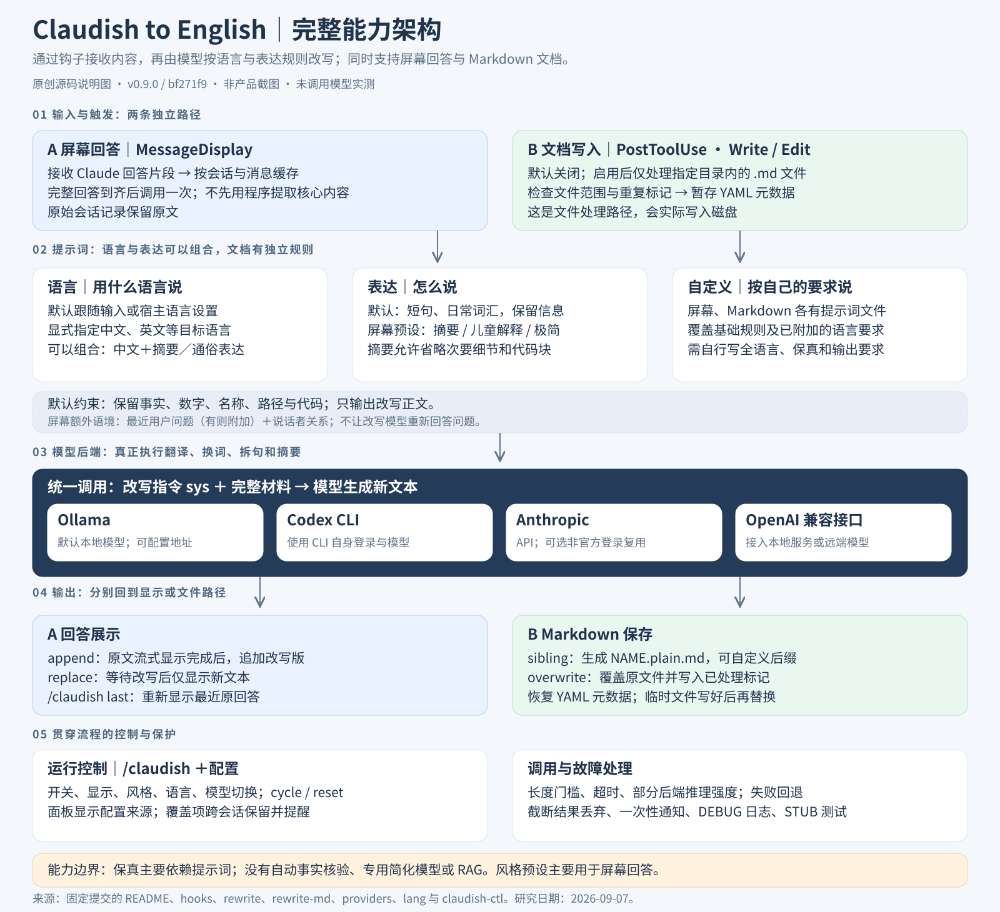
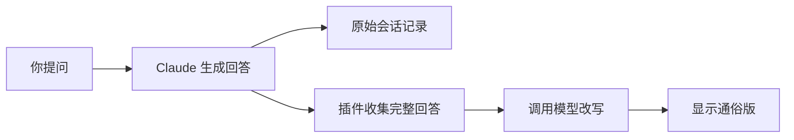

# 008 · Claudish to English · AI 回答通俗化研究

> 通过 Claude Code 钩子，对屏幕回答和指定 Markdown 文档进行二次改写；支持通俗表达、摘要、语言转换、自定义提示词、模型选择和运行控制。

[返回总索引](../../README.md) · [研究记录](notes.md) · [上游仓库](https://github.com/gvzdv/claudish-to-english)

[一张图理解：提示词如何驱动简化](prompt-mechanism.md)

[完整能力复核：语言、风格、显示、文档与运行控制](capability-audit.md)

## 完整能力架构图



[查看 PNG 大图](../../docs/assets/projects/008-claudish-to-english/capability-architecture.png) · [可缩放 SVG](../../docs/assets/projects/008-claudish-to-english/capability-architecture.svg)

这是依据固定版本源码绘制的原创说明图，不是产品截图或实测输出。蓝色为回答路径，绿色为文件路径。使用 `node projects/008-claudish-to-english/build-architecture.mjs` 可重建 SVG。

## 先用一个例子理解

你让 AI 修复手机网页，AI 回答：

> 已调整容器布局约束和溢出策略，消除小视口下的横向滚动。

这个插件可以将这类回答改写成更容易理解的表达，例如：

> 改好了。现在手机上的网页内容不会超出屏幕，不用左右拖动了。

**这是人工编写的说明示例，不是插件实测结果。** 网页仍由原来的编程助手修改，插件只负责重新表达说明。可以理解为工程师解决问题，编辑把说明整理给读者看。

## 项目档案

| 项目 | 内容 |
| --- | --- |
| 上游 | gvzdv/claudish-to-english |
| 研究版本 | v0.9.0 |
| 固定提交 | `bf271f95fd2c1a7d00ea545bbc6de44a1b6a1d3c` |
| 上游许可证 | MIT；复用代码需保留版权与许可声明 |
| 研究日期 | 2026-09-07 |
| 状态 | 研究中：已阅读源码，未安装插件或调用模型实测 |
| 演示 | 暂无，不将人工示例作为运行证据 |

## 能力是什么

| 能力 | 能得到什么 | 边界 |
| --- | --- | --- |
| 通俗改写 | 复杂解释换成短句和日常表达 | 保真取决于模型，不能自动核实事实 |
| 简短摘要 | 更快了解长回答的重点 | 会省略代码块与次要细节 |
| 风格切换 | 儿童易懂解释、极简口吻等 | 风格预设主要作用于屏幕回答 |
| 指定语言 | 可要求使用简体中文等语言 | 中文效果尚未实测 |
| 原文对照 | 默认先显示原文，再附通俗版 | 会增加屏幕文字总量 |
| 仅显示改写 | 只呈现整理后的回答 | 要等待原文生成及二次改写 |
| Markdown 副本 | 为指定目录生成 `.plain.md` | 必须主动配置，不是任意文件监听器 |
| 自定义规则 | 按自己的读者与写作要求改写 | 需要明确保留事实等要求 |

名称虽有 English，但当前实现支持其他语言，默认通常跟随输入语言。它是 Claude Code 插件；支持其他模型后端，不等于适配了其他助手的插件系统。

## 意义与使用场景

它解决的是反复阅读、理解和要求重说的成本。

| 场景 | 什么时候值得用 | 什么时候直接提问就够了 |
| --- | --- | --- |
| 非技术人员用编程助手 | 经常看不懂修改说明，希望自动通俗化 | 偶尔一个术语不懂 |
| 高频阅读 AI 长回复 | 每天都需要摘要 | 原回答已简短清楚 |
| 文档给新人或客户阅读 | 经常需要文档的通俗副本 | 仅一篇文档要改写 |
| 不同语言的读者 | 希望统一输出语言 | 原助手已能稳定按要求写作 |

**如果直接说“请用大白话解释，并举例”已经满足需求，就不必专门增加插件。** 它的价值是将经常发生的改写自动化，而不是提供一种只有它才能做到的能力。

## 底层原理



核心是“事件钩子＋文本缓存＋第二次模型调用”，没有训练专用模型，也没有知识库检索流程。

1. `MessageDisplay` 事件把新显示的回答片段交给脚本。
2. `rewrite.sh` 按会话、消息和片段顺序缓存，到最后一段才调用模型。
3. 提示词要求简化表达并保留事实、名称、数字和路径，同时补充最近的用户问题，说明“我／你”分别指谁。
4. `providers.sh` 调用 Ollama、Anthropic、OpenAI 兼容接口或 Codex CLI。
5. 返回改写版供界面显示；常见超时、空返回等错误走原文回退路径。

显示改写不改变原始会话文本。改写模型可以不同于原助手使用的模型，但不要求一定不同。每条被处理的回答会增加一次改写调用。

文档走另一条路径：`PostToolUse` 在 `Write/Edit` 后触发，检查目录和 `.md`，然后生成副本或覆盖文件。脚本单独取出并恢复 YAML 元数据，先写临时文件再替换目标文件。代码块保护主要依赖提示词。

## 固定版本源码入口

| 文件 | 阅读重点 |
| --- | --- |
| [hooks/hooks.json](https://github.com/gvzdv/claudish-to-english/blob/bf271f95fd2c1a7d00ea545bbc6de44a1b6a1d3c/hooks/hooks.json) | 三个事件与触发方式 |
| [rewrite.sh](https://github.com/gvzdv/claudish-to-english/blob/bf271f95fd2c1a7d00ea545bbc6de44a1b6a1d3c/rewrite.sh) | 缓存、提示词、显示及回退 |
| [rewrite-md.sh](https://github.com/gvzdv/claudish-to-english/blob/bf271f95fd2c1a7d00ea545bbc6de44a1b6a1d3c/rewrite-md.sh) | 文档范围、副本及写入 |
| [providers.sh](https://github.com/gvzdv/claudish-to-english/blob/bf271f95fd2c1a7d00ea545bbc6de44a1b6a1d3c/providers.sh) | 后端与错误处理 |
| [README.md](https://github.com/gvzdv/claudish-to-english/blob/bf271f95fd2c1a7d00ea545bbc6de44a1b6a1d3c/README.md) | 安装、命令和配置 |
| [插件版本](https://github.com/gvzdv/claudish-to-english/blob/bf271f95fd2c1a7d00ea545bbc6de44a1b6a1d3c/.claude-plugin/plugin.json) | 版本与插件信息 |
| [LICENSE](https://github.com/gvzdv/claudish-to-english/blob/bf271f95fd2c1a7d00ea545bbc6de44a1b6a1d3c/LICENSE) | MIT 许可 |

## 如何试用（尚未执行）

需要支持相关钩子的 Claude Code，以及 Bash、jq、curl。Windows 使用 Git Bash。本地后端还需运行 Ollama，并下载适合机器的模型。上游默认使用 MLX 模型标签，Windows 应显式选择普通标签；试验时需核实模型可用性。

在 Claude Code 中安装：

```text
/plugin marketplace add gvzdv/claudish-to-english
/plugin install claudish-to-english@gvzdv-plugins
```

这些命令安装当时可用版本，不保证等于本研究提交。固定版本复现可将上游置于仓库外临时目录，检出上述提交，再用 `claude --plugin-dir <本地插件目录>` 试用；记录实际运行环境。

先配置 `CLAUDISH_PROVIDER=ollama` 和已下载的 `CLAUDISH_MODEL`，再选择原文对照和中文：

```text
/claudish append
/claudish language 简体中文
```

提出一个需要较长解释的问题，观察原文后是否有通俗版。短回答可能被长度门槛跳过。检查数字、路径和适用条件是否保留。

文档实验只对测试目录设置 `CLAUDISH_MD_DIR`，采用 `CLAUDISH_MD_MODE=sibling`，预期生成 `NAME.plain.md`。

## 局限与尚未验证的部分

- 通俗表达不等于事实正确；没有自动检查数字、条件、链接和代码是否一致的完整流程。
- 二次调用增加等待与资源消耗；云端会接收待改写内容，显示改写还可能携带最近的用户问题。
- 替换模式隐藏原文片段，必须等完整回答改写后再显示。
- 文档副本仍需校对；覆盖模式的已改写标记会影响后续再次处理。
- 宿主兼容性待本机验证。[官方 issue #85773](https://github.com/anthropics/claude-code/issues/85773) 曾报告特定版本交互界面忽略改写输出，不能据此推断所有版本都有问题或已经修复。

## 对我们的意义

可以让每个研究项目保留详细证据，同时提供入门版，让访客先理解“能做什么、适合谁、有没有必要用”。例如，Multica 详细稿解释调度实现，入门稿解释多个 AI 如何分工，失败后谁处理。

建议先选三篇现有研究稿生成通俗副本，与直接要求原助手写清楚的结果对比。只有阅读改善明显且关键事实保留可靠，才值得接入研究站。

## 扩展方向（我们的建议，尚未实现）

| 优先级 | 扩展 | 目的 |
| --- | --- | --- |
| 高 | 数字、链接、路径、否定和限制条件检查 | 防止改变原意 |
| 高 | 提取代码块，正文改写后恢复 | 将代码保护落实为程序机制 |
| 高 | 中文术语表与真实案例评测 | 确认适合中文研究文档 |
| 中 | 原文／通俗版切换与段落对照 | 便于核查和深入阅读 |
| 中 | 按需生成与缓存 | 减少重复调用 |

## 本阶段结论

已完成能力、场景、原理和局限的源码理解，并用完整架构图展示。我们的理解归纳为四点：

1. **默认目标是通俗表达，可叠加语言转换。** README 的 plain-English 不能只理解成“转成英语”；默认可跟随输入语言，指定目标语言后按该语言改写。
2. **两条处理路径必须区分。** 屏幕路径保留会话原文；Markdown 路径生成副本或覆盖文件，实际改变磁盘内容。
3. **简化由模型执行，钩子负责自动衔接。** 程序收集完整回答、组装指令、调用后端、展示结果；没有先提取核心内容的独立模型阶段。
4. **工程能力包括使用控制与故障处理。** 原文恢复、运行中切换、跨会话设置、后端适配和调试也是库的一部分；保真提示词不等于自动事实核验。

对我们最直接的借鉴是“详细研究稿＋可核查的读者版”。是否实际接入，仍需中文改写质量和阅读收益实验决定。本阶段没有安装或实测插件，不将教学示例及说明图当作真实运行结果。
