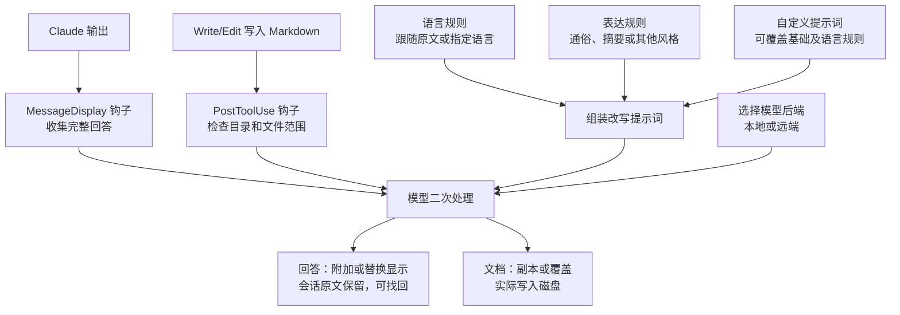

# 能力复核：表达、语言、显示与文件处理

复核日期：2026-09-07。范围：v0.9.0，提交 `bf271f95fd2c1a7d00ea545bbc6de44a1b6a1d3c` 的 README、命令、语言解析、后端和会话提醒脚本。以下为源码能力清单，未安装实测。

## 先澄清定位

README 的 plain-English 是“通俗英语”的意思，不能只按“输出改成英语”理解。同一 README 的 Output language 明确说明：默认跟随原文语言，配置后才指定其他语言。

更完整的定位：通过 Claude Code 钩子，对回答显示及指定 Markdown 文档进行可配置的二次改写。语言、表达风格、显示方式与模型后端是不同维度。

## 完整能力清单

| 维度 | 已有能力 | 关键边界／此前说明不足 |
| --- | --- | --- |
| 表达 | 默认通俗改写；tldr 摘要；5y 儿童易懂表达；caveman 极简口吻 | 摘要允许省略次要信息和代码；不是全部模式都压缩信息 |
| 语言 | 跟随输入语言、读取宿主语言设置、显式指定目标语言 | 与风格可以组合，例如中文摘要；不是固定转英语 |
| 展示 | append 原文后追加；replace 仅显示改写 | 显示层不修改原始会话记录 |
| 找回原文 | `/claudish last` 重显最近原回答 | 使用跳过标记避免再次改写；不代表所有改写版都已归档 |
| 文档 | Write/Edit 后处理指定目录的 Markdown；生成副本或覆盖原文件 | 默认关闭；这是实际文件写入，与 display-only 不同 |
| 文档配置 | 自定义副本后缀和独立文档提示词 | 屏幕风格预设不自动套到文档；语言、模型等可共享 |
| 自定义提示词 | 屏幕与文档分别支持提示词文件 | 替换基础指令及此前附加的语言规则；需自行写全保真与语言要求 |
| 运行中控制 | 开关、切换显示、风格、语言、模型；cycle；reset | 文件标记让设置在后续消息生效；切换模型仍在当前后端内 |
| 状态可见性 | 控制面板显示值与来源；新会话提醒残留覆盖项 | 运行中覆盖项会跨会话保留，不是仅当次临时设置 |
| 后端 | Ollama、Codex CLI、Anthropic、OpenAI 兼容接口 | 可配置地址；兼容接口支持接入本地服务或远端服务 |
| 认证路径 | API key、Codex CLI 自身登录；Anthropic 可选 OAuth 路径 | 上游将 Anthropic 登录复用标为非官方；不作为默认推荐方案 |
| 调用控制 | 长度门槛、显示与文档独立超时、部分后端推理强度控制 | 不是每条文字都会调用模型；长度门槛代码按去空白后的字节计数，中文不等于字数 |
| 故障处理 | 常见失败回退；识别输出截断并丢弃；一次性原因提示 | 这些是传输和运行层保护，不是事实审查 |
| 调试 | DEBUG 日志、STUB 确定性占位输出 | 可不调用模型验证显示流程，但不能据此证明改写质量 |

## 原理全貌

图中的风格预设主要针对回答；文档有独立提示词。回答路径还会补充说话者关系和存在时的最近用户问题。

## 真正遗漏或弱化的重点

1. 语言和风格是可组合维度，应与显示模式分开讲解。
2. 仅改屏幕与实际改文件是两条路径，不能用“只改显示”概括整个插件。
3. 找回原文、会话内切换、跨会话保存和状态面板是完整使用体验的一部分。
4. 后端接入、超时和调试让它超出单条提示词，但不是另一个自主执行任务的 Agent。

未发现：专门训练的简化模型、RAG、独立核心内容提取阶段、事实自动核验、语音能力或 PDF/Word 原生处理。术语表校验、并排差异高亮、批量目录翻译、翻译记忆库属于可能的扩展，不能列为上游现成功能。

## 对现有结论的修正

最初只强调简化，遗漏了配置与运行能力；随后为强调语言转换而把目标语言提得过重，也可能误导。准确描述应是：默认通俗改写，可叠加指定语言，支持显示和 Markdown 两种输出路径，并提供模型选择及运行控制。

来源均固定于研究提交：[README](https://github.com/gvzdv/claudish-to-english/blob/bf271f95fd2c1a7d00ea545bbc6de44a1b6a1d3c/README.md)、[显示处理](https://github.com/gvzdv/claudish-to-english/blob/bf271f95fd2c1a7d00ea545bbc6de44a1b6a1d3c/rewrite.sh)、[命令控制](https://github.com/gvzdv/claudish-to-english/blob/bf271f95fd2c1a7d00ea545bbc6de44a1b6a1d3c/claudish-ctl.sh)、[语言解析](https://github.com/gvzdv/claudish-to-english/blob/bf271f95fd2c1a7d00ea545bbc6de44a1b6a1d3c/lang.sh)、[后端](https://github.com/gvzdv/claudish-to-english/blob/bf271f95fd2c1a7d00ea545bbc6de44a1b6a1d3c/providers.sh)。
