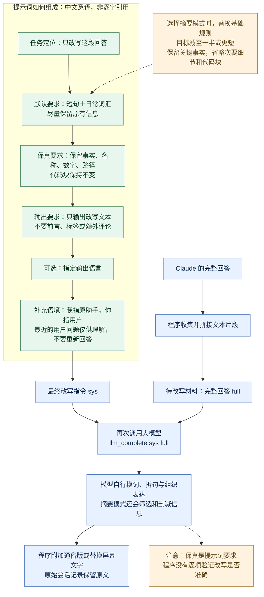

# 提示词如何驱动简化：一张图理解

核心是将完整回答作为待编辑材料，将改写目标和约束作为指令，再调用模型一次。程序没有先提取核心内容；摘要模式下的取舍由模型完成。

## 为什么这些提示词有用

- 任务定位把模型约束在编辑工作上，减少重新解题和额外发挥。
- 短句、日常词汇给出了具体的表达方向；默认不要求删掉大量信息。
- 事实、名称和数字等要求用于约束改写范围，但不是程序层面的正确性保证。
- 只输出正文减少套话；“我／你”的说明降低角色混淆。
- 用户问题帮助模型理解原回答，但明确限定为背景，避免再次作答。

以上解释是对提示词设计目的的分析，不是效果评测。最终简化能力来自所调用模型的语言能力，效果需要实际样本验证。

## 配置优先级与边界

图中展示默认路径和摘要分支。`5y`、`caveman` 也会替换基础提示词，分别引导儿童易懂表达和极简口吻。

有效的 `CLAUDISH_PROMPT_FILE` 会覆盖基础提示词和此前附加的语言指令；之后仍补充说话者关系，以及存在时的最近用户问题。不能认为自定义提示词自动继承默认保真规则。

最近用户问题只在会话记录可读、找到符合筛选条件的消息时加入，并截取最多 800 个 Unicode 码点；它不是整段会话或额外知识库。

主调用为 `llm_complete "$sys" "$full"`。后端适配器决定如何发送到实际模型；图里的“指令＋材料”表示逻辑结构，不代表所有后端都使用相同 API 字段。

本文聚焦屏幕回答的改写。Markdown 改写使用另一份提示词和文件处理流程。没有先提炼要点、再简化的独立两阶段调用，也没有对每次改写进行自动事实审查。

来源：[固定版本 rewrite.sh](https://github.com/gvzdv/claudish-to-english/blob/bf271f95fd2c1a7d00ea545bbc6de44a1b6a1d3c/rewrite.sh)。研究日期：2026-09-07；源码分析，未调用模型实测。
