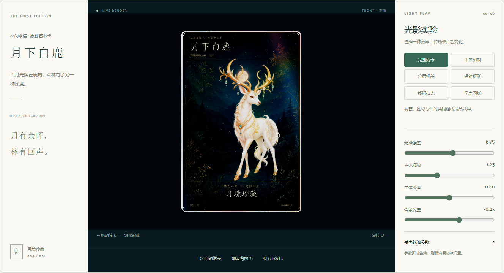

# 009 · Holo Card Studio · 全息闪卡制作研究

用一张原创「月下白鹿」闪卡展示分层视差、实时镭射和素材到交互成品的完整制作路径。核心认识是：**真实三维卡片外壳 + 2.5D 分层画面 + 随视角变化的材质效果**。

[Web 展示](https://yydshly.github.io/0906_codex_project/demos/009-holo-card-studio/) · [原仓库](https://github.com/EverettFish/holo-card-studio) · [实验记录](notes.md) · [素材提示词](art-prompts.md)

> 展示页作为静态资源随主仓库发布。本项目保留本地复现方式、可编辑工程与实际验证记录。



## 来源与研究版本

| 项目 | 记录 |
| --- | --- |
| 上游 | https://github.com/EverettFish/holo-card-studio |
| 固定提交 | `01acf39d2d01cac8a3e3879bff55750bcf1f107c` |
| 研究日期 | 2026-09-07 |
| 性质 | Claude Skill + Python 制作脚本 + Three.js 展示模板 |
| 许可证 | [MIT](upstream/LICENSE)，保留上游版权声明 |
| 实测环境 | Windows、Python 3.10 + Pillow、Blender 4.5.9 LTS、Three.js 0.180.0、esbuild 0.25.9、Edge |
| 状态 | 单卡构建与桌面/移动布局验证已完成，持续研究 |

`upstream/` 仅保留运行与对照所需的脚本、配置、网页模板和许可证，保持固定提交原文。没有导入完整上游仓库、依赖或 Blender 安装包。

## 能力怎么体验

| 模式 | 体验方式 |
| --- | --- |
| 完整闪卡 | 拖动卡面，观察白鹿、森林、虹彩与细闪共同变化 |
| 平面印刷 | 关闭画面内部视差与光效，与成品对照；卡片实体仍可转动 |
| 分层视差 | 白鹿与森林反向移动，文字保持原位 |
| 镭射虹彩 | 转动卡片，观察颜色条带跟随视角移动 |
| 线稿扫光 | 缓慢转动，细轮廓在光带经过时亮起 |
| 星点闪烁 | 背景稀疏闪点随时间和视角改变亮度 |

四个滑块控制光效强度、主体 UV 缩放、主体深度与背景深度。UV 缩放数值增大会扩大取样范围，因此画面中的主体变小。效果开关是本地教学扩展；导出配置保存上游支持的四个参数，不保存当前教学模式。

支持拖动、方向键、滚轮缩放、自动赏卡、按钮或 F 键翻面、R 键复位、保存当前 PNG、独立图层查看与下载。复位恢复视角、默认参数和完整效果。

## 实际交付

| 文件 | 内容 |
| --- | --- |
| [展示页](../../docs/demos/009-holo-card-studio/index.html) | 六种效果对照、四层素材、制作路径与应用场景 |
| [card.blend](../../docs/demos/009-holo-card-studio/assets/card.blend) | 上游脚本实际生成，四张图片已打包的可编辑工程 |
| [card.glb](../../docs/demos/009-holo-card-studio/assets/card.glb) | 从该工程导出的卡片几何，约 24 KB |
| [Blender 离线渲染](../../docs/demos/009-holo-card-studio/assets/blender-render.png) | 本机 Cycles 实际渲染，1080 × 1500 |
| [网页保存图](../../docs/assets/projects/009-holo-card-studio/web-render.png) | 实际点击「保存此刻」取得的 PNG |
| [素材校验](asset-validation.json) | 同尺寸、真实 Alpha、线稿明暗检查 |
| [Blender 验证](blender-verification.json) | 环境、图像打包、旋转、共享参数和动画帧 |
| [浏览器验证](browser-verification.json) | 页面渲染、操作、下载与手机布局检查 |

[桌面完整截图](../../docs/assets/projects/009-holo-card-studio/desktop.png) · [移动布局截图](../../docs/assets/projects/009-holo-card-studio/mobile.png) · [卡背截图](../../docs/assets/projects/009-holo-card-studio/back.png)

## 底层原理

### 我们的理解：卡面本质上是 2.5D

这里要区分「卡片这个物体」与「卡片里画的东西」。卡片外壳确实是三维的，白鹿和森林则主要是二维图片。程序在转动三维卡片的同时，根据观察方向实时改变各图片层的取样位置，并计算反光，因此产生画面内部的立体感。

| 部分 | 实际表示 | 能看到的变化 | 能力边界 |
| --- | --- | --- | --- |
| 卡片厚度、边框、正反面 | Blender 导出的真实三维几何 | 倾斜时露出侧边，翻转后看到卡背 | 这是卡片的三维结构 |
| 白鹿与森林 | 分层二维图片，带不同的深度参数 | 转动时各层产生不同位移，形成前后层次 | 白鹿没有完整三维表面 |
| 文字 | 零视差的透明图层 | 跟随卡片整体转动，保持相对版面稳定 | 不随白鹿的内部视差漂移 |
| 虹彩、线稿扫光、闪点 | 实时着色器计算 | 颜色、光带和亮度随角度或时间变化 | 视觉模拟，不是真实光学全息重建 |

**最直观的判断：转动卡片，能不能看到白鹿原图里没有画出的另一侧身体？** 当前实现不能。转到背面看到的是卡背，不是白鹿的背部。某些背景区域可以随着前景位移显露，因为它们已存在于独立背景图中；这也不等于生成了白鹿的新视角。

因此，「对图片进行处理而获得 3D 观感」这个理解基本正确，但这里还包含真实三维卡壳，以及随交互实时变化的处理，并非只做一次静态滤镜。Blender 负责卡片建模、材质节点、动画和渲染，没有把白鹿图片重建成三维白鹿。

| 路径 | 表达方式 | 对我们意味着什么 |
| --- | --- | --- |
| 普通二维卡面 | 图片和文字位于同一平面 | 适合直接展示内容，画面内部没有分层视差 |
| 当前 2.5D 卡面 | 图片分层 + 视角驱动位移和光效 | 用已有画作制作交互纪念卡；新增成本主要在分层素材与材质调校 |
| 完整三维主体 | 具有表面、体积和各方向几何的角色或物体 | 适合绕到侧后方观察、改变姿态；需额外建模、材质，涉及动作时还需绑定或动画 |

增加更多图层或深度图能丰富 2.5D 层次，但不会自动得到完整三维角色。若希望白鹿转身、行走或从任意方向被观察，就需要增加三维主体制作流程。

### 四层图片与视差

背景、主体、线稿、文字均为 1024 × 1536 PNG。主体有真实透明通道；白底黑线用于生成发光遮罩；文字用上游 Pillow 脚本精确排版。

核心公式：

```text
uv' = (uv - 0.5) × scale + 0.5
    + view.xy / max(abs(view.z), 0.35) × depth × 0.14
```

视线变换到卡片规范坐标系。正负深度形成相反偏移，分母限幅避免掠射角位移爆开。主体和线稿共用视差与排版安全区；文字覆盖在固定 UV 上。默认主体深度 0.4、背景深度 −0.25、文字深度 0。

### 镭射、线稿与闪点

- 镭射：视线参与条纹和噪声计算，映射到粉、黄、蓝、白光谱后叠加原色。
- 线稿：深色轮廓经阈值提取，乘上移动扫光，只让局部细线亮起。
- 闪点：Voronoi 类边缘距离与稀疏噪声形成细闪，时间与角度控制闪烁。
- 辉光：后处理为高亮区域增加适度光晕。

这是闪卡观感的实时模拟，没有计算真实光波的干涉或衍射。卡片外壳有实际几何，画面中的白鹿仍是带视差的图片，不是完整三维动物。

### Blender 与网页的分工

```text
描述 / 参考图 → 图像生成工具 → 四层素材 + 配置
                                   ↓
                         上游 Blender 构建脚本
                            ↙           ↘
                可编辑工程 / 离线渲染    GLB 几何
                                          ↓
                       图片 + 参数 + Three.js 材质重建
                                          ↓
                                     交互展示页
```

导出使用 `web_front`、`web_edge`、`web_back`、`web_gold` 约定识别材质角色。复杂 Blender 节点没有直接进入网页，两端材质分别实现。因此修改一端不会自动更新另一端，两端的色彩、辉光和背面细节存在差异。

## 上游能力与本地扩展

| 内容 | 来源与状态 |
| --- | --- |
| 卡片几何、共享视差节点、材质、动画、离线渲染、GLB 导出 | 原样运行上游脚本，已实测 |
| 网页四层合成、镭射、扫光、闪点、基础交互 | 适配上游 app.js，已实测 |
| 白鹿、森林、线稿 | 本次内置图像工具创作的虚构素材 |
| 文字 PNG | 上游排版脚本，使用本机楷体，未分发字体文件 |
| 页面版式、六种效果组合、图层预览、参数导出 | 本地新增 |
| F 键翻面与复位 | 修复上游翻面前角度限幅问题，复位恢复按钮与参数 |
| 城市、人物、成就卡 | 可扩展方向，当前没有多主题作品或卡册系统 |

适配过程见 [adapt-upstream.mjs](adapt-upstream.mjs)。上游原文与本地源码分别保存，便于检查差异。

## 运行与复现

### 体验网页

在仓库根目录执行：

```powershell
python -m http.server 4179 --bind 127.0.0.1 --directory docs
```

访问 `http://127.0.0.1:4179/demos/009-holo-card-studio/`。页面依赖已打包，无需 npm、外部 CDN 或生成服务；需要支持 WebGL 的浏览器，不要直接使用 file 协议打开 HTML。

### 修改网页

```powershell
cd projects/009-holo-card-studio
npm.cmd ci --ignore-scripts --no-audit --no-fund
node adapt-upstream.mjs
npm.cmd run build
```

核心适配写在 `adapt-upstream.mjs`，教学交互写在 `web-src/lab.js`，不要手改压缩后的 app.js。页面结构与样式位于 `docs/demos/009-holo-card-studio/`。

### 重建 Blender

需要 Python + Pillow，复用已保存的素材：

```powershell
./projects/009-holo-card-studio/reproduce.ps1 -Blender 'C:/path/to/blender.exe'
```

不传 Blender 路径时，原库会寻找或安装官方便携版。本次原库 Python 请求返回 HTTP 403，改用 PowerShell 获取官方 Blender 4.5.9 ZIP 与 SHA-256，核对后解压至忽略目录 `tmp/holo-build/tools/`。

默认复用已生成的文字图。修改卡名等文字配置后，需运行上游 `generate_typography.py`，并同步新的文字图至展示素材目录。

### 更新首页

```powershell
npm.cmd run sync
npm.cmd run check
```

## 验证与局限

- Blender 实际保存工程、渲染和 GLB，四张图全部打包。
- 桌面 1440 × 1120 与移动布局 390 × 844 检查通过，无页面脚本错误和失败资源请求；手机文档宽度 390，没有横向溢出。
- 拖动实际改变角度；按钮翻面到约 π，F 键回到正面；移动布局翻面通过。
- 六种组合、参数修改与复位、图层与说明弹窗、参数下载与 PNG 下载均已验证。
- [最终检查](final-verification.json)进一步记录各效果相对平面模式的实际像素变化、本地下载链接和首页登记入口；这能确认光效影响画面，不代表完整的视觉质量评估。
- 生成线稿经目视检查，轮廓基本一致，不宣称像素级对齐；原库基础校验也不能证明语义对齐。
- 手机测试是桌面浏览器尺寸模拟，尚未测试真实手机帧率、触摸手感和所有浏览器。
- 当前单卡，生成发生在本地工具流程；不提供网页在线生成、账户、卡册、交易或印刷生产。

## 对我们的价值与后续方向

可与 005 栖居结合成人物与生活事件卡，与 006 Prettymaps 结合成城市纪念卡，或为 002 青团制作角色典藏卡。更可复用的价值是「AI 素材 + 参数配置 + 可重复构建 + 可编辑源工程 + 交互交付」的制作方法。

优先扩展模板化版式与卡背、素材对齐校验、多卡配置、真实手机性能分级、双端同角度对照。上游代码 MIT 不自动覆盖生成画作或用户素材，本研究仓库未指定统一许可证，详见 [来源说明](../../docs/demos/009-holo-card-studio/THIRD-PARTY.txt)。
